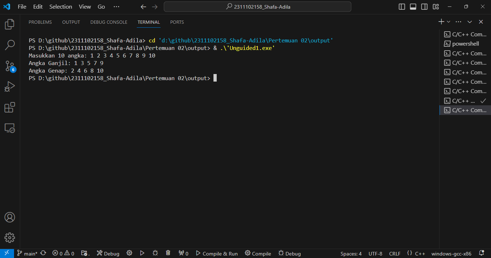
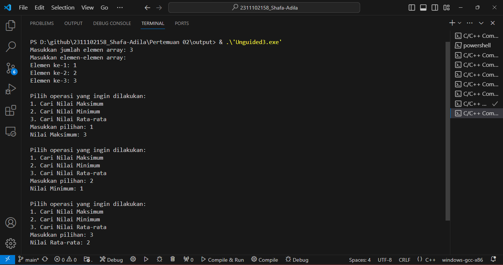

# <h1 align="center">Laporan Praktikum Modul Array</h1>
<p align="center">Shafa Adila Santoso - 2311102158</p>

## Dasar Teori
Array merupakan suatu kumpulan data terstruktur yang berupa sejumlah data terstruktur yang beurpa sejumlah data sejenis (memiliki jenis data yang sama) yang jumlahnya tetap dan diberi suatu nama tertentu. Sebuah array dapat diibaratkan sekumpulan kotak ynag menyimpan sekumpulan elemen betipe sama secara berurutan (sequential) didalam memori komputer. Array juga dapat diibaratkan sebagai elemen elemen yang disusun seara vertikal sehingga dinamai tabel. Setiap elemen array data diacu melalui indeksnya. Karena elemen array disimpan secara berurutan, indeks array haruslah suatu tipe yang juga mempunyai keterurutan.
-Array dimensi Satu
Array dimensi satu merupakan sekumpulan item yang disusun secara baik menjadi suatu rangkaian dan diacu atau ditunjuk oleh satu identifier. Item data individual dalam array bisa ditunjuk secara terpisah dengan menyatakan posisinya dalam array itu.
-Array dua dimensi
Array dua dimensi sering dianalogikan dan digambarkan sebagai bentuk matriks, dengan indeks pertama berfungsi debagai baris dan indeks kedua digunakan untuk kolom. Beberapa kolom dan baris pada array dua dimensi terdapat dua jumlah elemen yang terdapat didalam kurung siku dan keduanya boleh tidak sama.
-Array Multidimensi 
Array multidimensi merupakan struktur data yang dapat menyimpan elemen dalam bentuk tabel dengan banyak dimensi. Artinya setiap elemen dalam array mempunyai satu atau lebih indeks yang menunjukkan posisinya di setiap dimensi. Dengan kata lain, array multidimensi adalah matriks atau tabel dengan baris dan kolom, atau kumpulan elemen yang disusun dalam format dimensi lebih tinggi seperti matriks 3 dimensi atau matriks 4 dimensi.
-Array Empat Dimensi
Array empat dimensi adalah struktur data yang dapat menyimpan elemen dalam empat dimensi berbeda.  Artinya setiap elemen dalam array mempunyai empat indeks yang menunjukkan posisinya di setiap dimensi. Oleh karena itu, array empat dimensi dapat dianggap sebagai kumpulan elemen yang disusun dalam bentuk "kubus 4D", dan elemen tersebut dapat diakses melalui empat indeks yang sesuai. Array empat dimensi sering digunakan dalam konteks ilmiah dan teknik yang melibatkan data dengan struktur  kompleks, seperti: Pemodelan fisik, analisis medis berbasis gambar, analisis keuangan, dan banyak lagi. Dalam pemrograman, Anda bisa menggunakan konsep array bersarang untuk mencapai array empat dimensi. Dalam hal ini, Anda dapat menyarangkan array multidimensi ke dalam array lain untuk membuat struktur data seperti ini: Dimensi keempat.
-Array Lima Dimensi
Array lima dimensi adalah struktur data  pemrograman yang memungkinkan elemen disimpan dalam lima dimensi berbeda. Artinya setiap elemen dalam array  memiliki lima indeks yang digunakan untuk mengidentifikasi posisinya di setiap dimensi. Dengan kata lain, array 5 dimensi adalah kumpulan elemen yang disusun dalam ruang 5 dimensi, dimana setiap elemen dapat diakses melalui 5 indeks yang sesuai.


## Guided 

### 1. [Array Tiga Dimensi]

```C++
#include <iostream>
using namespace std;

// PROGRAM INPUT ARRAY 3 DIMENSI
int main()
{

    // Deklarasi array
    int arr[2][3][3];
    // Input elemen
    for (int x = 0; x < 2; x++) //Perulanan untuk matriks ke-2
    {
        for (int y = 0; y < 3; y++) //Perulangan untuk baris
        {
            for (int z = 0; z < 3; z++) //Perulangan untuk kolom
            {
                cout << "Input Array[" << x << "][" << y << "][" <<
z << "] = ";
        cin >> arr[x][y][z]; //Meminta pengguna untuk menginputkan nilai array
        }
    }
    cout << endl;
  }
    // Output Array
    for (int x = 0; x < 2; x++) //Perulangan untuk matriks ke-2
    {
        for (int y = 0; y < 3; y++) //Perulangan untuk baris
        {
            for (int z = 0; z < 3; z++) //Perulangan untuk kolom
            {
                cout << "Data Array[" << x << "][" << y << "][" << z
<< "] = " << arr[x][y][z] << endl; //Menampilkan nilai array
            }
        }
    }
    cout << endl;
    // Tampilan array
    for (int x = 0; x < 2; x++) //Perulangan untuk matriks ke-2
    {
        for (int y = 0; y < 3; y++) //Perulangan untuk baris
        {
            for (int z = 0; z < 3; z++) //Perulangan untuk kolom
            {
                cout << arr[x][y][z] << ends; 
            }
            cout << endl;
        }
        cout << endl;
    }
}

```
Program diatas adalah program c++ yang menggunakan array tiga dimensi. Program diatas meminta penguna untuk menginputkan nilai kedalam array lalu mencetak nilai tersebut ke output. Didalam fungsi "main()", sebuah array tiga dimensi dideklarasikan menggunakan tipe data integer. Selanjutnya program meminta pengguna untukmenginputkan nilai kedalam array. Setelah semua elemen array diisi, program akan mencetak nilai array pada output menggunakan perulangan. Selanjutnya program akan mencetak nilai array dalam format yang lebih sederhana pada output.

### 2. [Nilai Maksimal pada Array]

```C++
#include <iostream>
using namespace std;

int main()
{
    int maks, a, i = 1, lokasi; //deklarasi variabel untuk nilai maksimum, panjang array, indeks, dan lokasi nilai maksimum
    cout << "Masukkan panjang array: ";//Meminta pengguna untuk menginputkan panjang array
    cin >> a;
    int array[a]; //Mendeklarasikan sesuai dengan panjang yang telah diinputkan oleh pengguna
    cout << "Masukkan " << a << " angka\n";
    for (i = 0; i < a; i++) //Perulangan untuk memasukkan nilai nilai array
    {
        cout << "Array ke-" << (i) << ": "; //Meminta pengguna untuk menginputkan array ke-i
        cin >> array[i];
    }
    maks = array[0]; //Inialisasi nilai maksimum dengan nilai pertama array
    for (i = 0; i < a; i++) //Perulangan untuk mencari nilai maksimum
    {
        if (array[i] > maks) //Menyeleksi jika array ke-i lebih besar dari nilai maksimum
        {
            maks = array[i]; //Update nilai maksimum dengan nilai array ke-i
            lokasi = i; //Update lokasi nilai maksimum dengan indeks i
        }
    }
    cout << "Nilai maksimum adalah " << maks << " berada di Array ke " << lokasi << endl; //Menampilkan output yang berpa nilai maksimum beserta lokasinya
}
```
Program diatas adlah program c++ yang dapat mencari nilai maksimum daalam array yang sudah diinputkan oleh pengguna. Pertama program mendeklarasikan variabel `maks` untuk menyimpan nilai maksimum, `a` untuk menyimpan panjang array, `i` sebagai variabel penghitung loop dna `lokasi` untuk menyimpan indeks lokasi nilai maksimum. Kemuadian pengguna diminta untuk menginputkan panjang array dan kemudian nilai nilai array. Selanjutnya dengan menggunakan perulangan provram akan memeriksa stiap elemen dalam array kemudian dicetak opada output. 

## Unguided 

### 1. [SoalBuatlah program untuk menampilkan Output seperti berikut dengan data yang diinputkan oleh user]

```C++
#include <iostream> //Library iostream untuk fungsi input-output
using namespace std; //Menggunakan using namespace std agar tidak perlu menuliskan std:: 

int main() {
    const int maksSize = 10; //Mendefinisikan konstanta untuk ukuran maksimum array
    int angka_158[maksSize]; //Mendeklarasikan array untuk menyimpan angka angka yang dimasukkan oleh penggun
    int angkaGanjil_158[maksSize], angkaGenap_158[maksSize]; //Mendeklarasikan array untuk menyimpan angka angka ganjil dan genap
    int jmlGanjil_158 = 0, jmlGenap_158 = 0; //Mendeklarasikan variabel untuk menghitung jumlah angka ganjil dan genap

    // Meminta pengguna untuk menginputkan angka
    cout << "Masukkan " << maksSize << " angka: ";
        for (int i = 0; i < maksSize; ++i) {
        cin >> angka_158[i];
            if (angka_158[i] % 2 == 0) {
                angkaGenap_158[jmlGenap_158] = angka_158[i]; //Menympan angka genap ke dalam array angkaGenap_158
                jmlGenap_158++; //Mengurutkan angka ganjil secara Descending
            } else {
                angkaGanjil_158[jmlGanjil_158] = angka_158[i]; //Menyimpan angka ganjil kedalam array angkaGanjil_158
                jmlGanjil_158++; //Mengurutkan angka ganjil secara Desecending
            }
        }

    // Menampilkan output angka ganjil
    cout << "Angka Ganjil: ";
    for (int i = 0; i < jmlGanjil_158; i++) { //Perulangan untuk mengakses setiap elemen angkaGanjil_158
        cout << angkaGanjil_158[i] << " ";
    }
    cout << endl;

    //Menampilkan output angka genap
    cout << "Angka Genap: ";
    for (int i = 0; i < jmlGenap_158; i++) { //Perulangan untuk mengakses setiap elemen angkaGenap_158
        cout << angkaGenap_158[i] << " ";
    }
    cout << endl;

    return 0;
}

```
#### Output:


Program diatas adlah  program c++ dengan menggunakan array. Program diatas eminta pengguna untuk menginputkan 10 angka secara berurutan dan angka tersebut akan disimpan dalam sebuah array “angka_158”. Kemudian pada program angka kan dibagi menjadi dua kelompok, yaitu ganjil dan genap lalu menyimpannya kedalam array “angkaGanjil_158” dan array “angkaGenap_158”. Setelah semua angka diproses, program akan menampilkan angka ganjil dan genap pada output.

### 2. [Soal Buatlah program Input array tiga dimensi (seperti pada guided) tetapi jumlah atau ukuran elemennya diinputkan oleh user!]

```C++
#include <iostream> //Library iostream untuk memasukkan header file kedalam program
using namespace std;//using namespace std digunakan agra tidak perlu menggunakan std::

int main() {
    int xSize, ySize, zSize;

    // Meminta pengguna untuk menginputkan ukuran atau jumlah elemen array
    cout << "Masukkan jumlah elemen untuk dimensi x: ";
    cin >> xSize;
    cout << "Masukkan jumlah elemen untuk dimensi y: ";
    cin >> ySize;
    cout << "Masukkan jumlah elemen untuk dimensi z: ";
    cin >> zSize;

    // Deklarasi array sesuai dengan ukuran yang dimasukkan pengguna
    int arr[xSize][ySize][zSize];

    // Input elemen array
    for (int x_158 = 0; x_158 < xSize; x_158++) { //Perulangan unruk mengakses elemen array
        for (int y_158 = 0; y_158 < ySize; y_158++) { //Perulangana untuk mengakses tiap baris array
            for (int z_158 = 0; z_158 < zSize; z_158++) { //Perulangan untuk mengakses tiap elemen dalam baris array
                cout << "Input Array[" << x_158 << "][" << y_158 << "][" << z_158 << "] = ";
                cin >> arr[x_158][y_158][z_158];
            }
        }
        cout << endl;
    }

    // Output elemen array
    for (int x = 0; x < xSize; x++) { //Perulangan untuk mengakses tiap elemen array
        for (int y = 0; y < ySize; y++) { //Perulangan untuk mengakses tiap baris array
            for (int z = 0; z < zSize; z++) { //Perulangan untuk mengakses taip elemen dalam baris array
                cout << "Data Array[" << x << "][" << y << "][" << z << "] = " << arr[x][y][z] << endl;
            }
        }
    }

    cout << endl;

    // Tampilan array tanpa label
    for (int x = 0; x < xSize; x++) { //Perulangan untuk mengakses tiap elemen array
        for (int y = 0; y < ySize; y++) { //Perulangan untuk mengakses tiap baris array
            for (int z = 0; z < zSize; z++) { //Perulangan untuk mengakses tiap elemen dalam baris array
                cout << arr[x][y][z] << ' ';
            }
            cout << endl;
        }
        cout << endl;
    }

    return 0; //Mengembalikan nilai 0 untuk menandakan berakhirnya program
}

```
#### Output:
.png)
.png)

Program diatas adalah sebuah program c++ yang menggunakan array. Program diatasb meminta pengguna untuk memasukkan ukuran atau jumlah elemen untuk setiap dimensi dari sebuah array berdimensi tiga. Setelah pengguna menginputkan jumlah elemen, kemudian program akan mendeklarasikan array sesuai dengan ukuran yang diinputkan oleh pengguna. Kemudian setelah elemen array diinputkan, program akan menampilkan kembali elemen elemen array bersama dengan indeksnya. Pada bagian akhir, pada output akan menampilkan elemen elemen array nya saja tanpa labe, hanya nilainya saja untuk melihatrkan keseluruhan array. Kemudian program mengembalikan nilai 0 untuk menandakan program berakhir.

### 3. [SoalBuatlah program menu untuk mencari nilai Maksimum, Minimum dan Nilai rata – rata dari suatu array dengan input yang dimasukan oleh user!]

```C++
#include <iostream> // Library untuk input-output
using namespace std; // Menggunakan namespace std agar tidak perlu menuliskan std:: sebelum cin, cout, dll.

int main() {
    int size;

    // Meminta pengguna untuk memasukkan ukuran atau jumlah elemen array
    cout << "Masukkan jumlah elemen array: ";
    cin >> size;

    // Deklarasi array sesuai dengan ukuran yang dimasukkan pengguna
    int arr[size];

    // Meminta pengguna untuk memasukkan elemen-elemen array
    cout << "Masukkan elemen-elemen array:" << endl;
    for (int i_158 = 0; i_158 < size; i_158++) {
        cout << "Elemen ke-" << i_158 + 1 << ": ";
        cin >> arr[i_158];
    }

    // Menu
    do{
        cout << endl;
        int pilihan;
        cout << "Pilih operasi yang ingin dilakukan:" << endl;
        cout << "1. Cari Nilai Maksimum" << endl;
        cout << "2. Cari Nilai Minimum" << endl;
        cout << "3. Cari Nilai Rata-rata" << endl;
        cout << "Masukkan pilihan: ";
        cin >> pilihan;

        switch (pilihan) {
            case 1: // Cari nilai maksimum
            {
                int max = arr[0];
                for (int i_158 = 1; i_158 < size; i_158++) {
                    if (arr[i_158] > max) {
                        max = arr[i_158];
                    }
                }
                cout << "Nilai Maksimum: " << max << endl;
                break;
            }
            case 2: // Cari nilai minimum
            {
                int min = arr[0];
                for (int i_158 = 1; i_158 < size; i_158++) {
                    if (arr[i_158] < min) {
                        min = arr[i_158];
                    }
                }
                cout << "Nilai Minimum: " << min << endl;
                break;
            }
            case 3: // Cari nilai rata-rata
            {
                int total = 0;
                for (int i_158 = 0; i_158 < size; i_158++) {
                    total += arr[i_158];
                }
                double average = static_cast<double>(total) / size;
                cout << "Nilai Rata-rata: " << average << endl;
                break;
            }
            default: // Pilihan tidak valid

                cout << "Pilihan tidak valid!" << endl;
        }
    }while (true);

    return 0; // Mengembalikan nilai 0 untuk menandakan bahwa program berakhir dengan sukses
}

```
#### Output:


Program C++ di atas memungkinkan pengguna untuk mengelola sebuah array dengan beberapa fungsi dasar, yaitu mencari nilai maksimum, minimum, atau rata-rata dari elemen-elemen array yang dimasukkan. Pertama, pengguna diminta untuk memasukkan jumlah elemen array yang diinginkan. Selanjutnya, pengguna diminta untuk memasukkan nilai-nilai elemen array tersebut. Setelah itu, sebuah menu ditampilkan yang memberikan opsi kepada pengguna untuk memilih operasi yang ingin dilakukan. Opsi tersebut mencakup mencari nilai maksimum, minimum, atau menghitung rata-rata dari elemen-elemen array. Pengguna diminta untuk memilih operasi yang diinginkan, dan program akan menjalankan operasi tersebut sesuai dengan pilihan pengguna menggunakan perulangan "do-while". Program menggunakan struktur "switch-case
" untuk mengeksekusi operasi sesuai dengan pilihan pengguna. Setelah operasi selesai dieksekusi, program akan kembali menampilkan menu dan meminta pengguna untuk memilih operasi lagi. Perulangan ini akan terus berlanjut hingga pengguna memilih untuk keluar dari program. Dengan demikian, program memberikan fleksibilitas kepada pengguna untuk melakukan berbagai operasi pada array yang dimasukkan.

## Kesimpulan
Praktikum dan pembelajaran mengenai Array ini sangat membantu saya dalam mempelajari tipe data array dalam berbagai dimensi, mulai dari Array berdimensi satu hingga array Multidimensi.

## Referensi
[1] Sihombing, J. (2019). Penerapan Stack Dan Queue Pada Array Dan Linked List Dalam Java. INFOKOM (Informatika & Komputer), 7(2), 15-24.<br/>
[2] Zenda, A. D. (2018). PENGERTIAN ARRAY.<br/>
