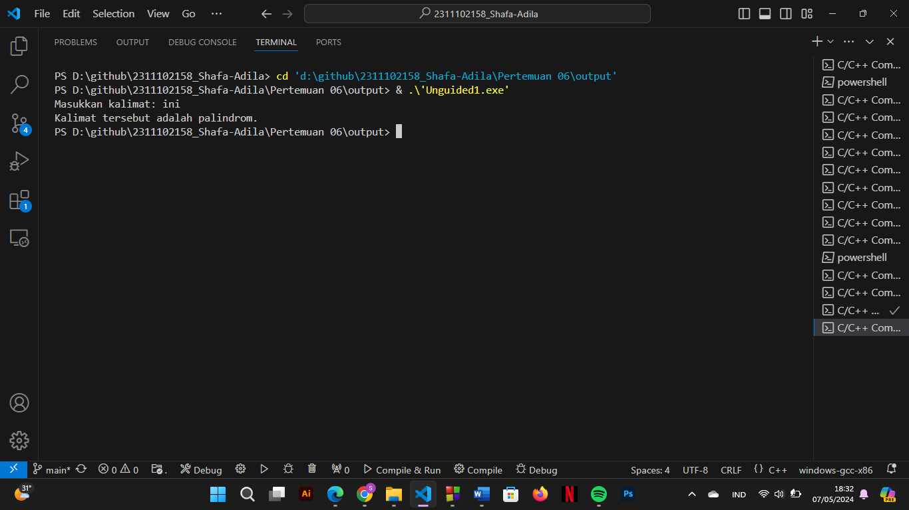
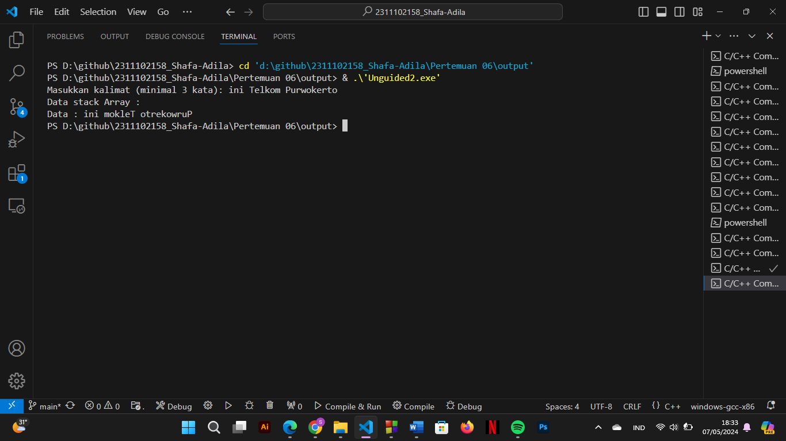

# <h1 align="center">Laporan Praktikum Modul Stack</h1>
<p align="center">Shafa Adila Santoso - 2311102158</p>

## Dasar Teori
Stack atau tumpukan adalah suatu struktur data yang penting dalam pemrograman dengan metode pemrosesan yang bersifat LIFO (Last In First Out) dimana objek atau benda yang terakhir diinputkan kedalam stack akan menjadi objek atau benda pertama yang dikeluarkan dari stack. Konsep LIFO tersebut memiliki beberapa proses. Pertama, proses push yang diibaratkan jika kita menyimpan buku diatas tumpukan buku. Kedua yaitu proses pop yang diibaratkan dengan pembambilan tumpukan buku pada tumpukan yang paling atas atau yang dapat disebut dengan top of the stack. Pada C++, ada dua buah cara penerapan prinsip stack yaitu array dan linked list. Setidaknya, stack harus memiliki operase - operasi dasar sebagai berikut :
1.	Push, fungsi ini berguna untuk menambahkan sebuah elemen ke dalam stack dan tidak bisa dilakukan lagi apabila stack sudah penuh.
2.	Pop, fungsi ini berguna untuk mengambil elemen teratas dari stack dengan syarat stack tidka boleh kosong.
3.	Clear, fungsi ini berguna untuk mengosongkan stack dengan mengeset Top dengan -1. Jika Top bernilai nol maka stack dianggap kosong dan sebaliknya.
4.	IsEmpty, fungsi ini berguna untuk menentukan apakah stack kosong atau tidak. Jika Top bernilai kurang dari nol maka stack kosong.
5.	IsFull, fungsi ini berguna untuk memeriksa apakah stack yang ada sudah penuh atau belum. Jika stack penuh maka puncak stack terdapat tepat dibawah jumlah maksimum yang bisa ditampung oleh stack atau dengan kata lain Top = MAX_STACK -1.
6.	Retrieve,  fungsi ini berguna untuk melihat nilai yang berbeda pada posisi tumpukan teratas.


## Guided 

### 1. [Program Stack]

```C++
#include <iostream>
using namespace std;

string arrayBuku[5]; // Array untuk menyimpan data buku
int maksimal = 5, top = 0;  // Variabel untuk batas maksimum dan posisi teratas stack

bool isFull() { // Fungsi untuk memeriksa apakah stack penuh
    return (top == maksimal); // Mengembalikan true jika stack penuh, false jika tidak
}

bool isEmpty() { // Fungsi untuk memeriksa apakah stack kosong
    return (top == 0); // Mengembalikan true jika stack kosong, false jika tidak
}

void pushArrayBuku(string data) { // Fungsi untuk menambahkan data ke stack
    if (isFull()) { // Jika stack penuh
        cout << "Data telah penuh" << endl; // Tampilkan pesan bahwa data penuh
    } else { // Jika tidak penuh
        arrayBuku[top] = data; // Tambahkan data ke stack
        top++; // Pindahkan posisi top
    }
}

void popArrayBuku() { // Fungsi untuk menghapus data dari stack
    if (isEmpty()) { // Jika stack kosong
        cout << "Tidak ada data yang dihapus" << endl; // Tampilkan pesan bahwa tidak ada data yang dihapus
    } else { // Jika tidak kosong
        arrayBuku[top - 1] = ""; // Hapus data dari stack
        top--; // Pindahkan posisi top
    }
}

void peekArrayBuku(int posisi) { // Fungsi untuk melihat data pada posisi tertentu dari stack
    if (isEmpty()) { // Jika stack kosong
        cout << "Tidak ada data yang bisa dilihat" << endl; // Tampilkan pesan bahwa tidak ada data yang bisa dilihat
    } else { // Jika tidak kosong
        int index = top; // Inisialisasi index dengan posisi top
        for (int i = 1; i <= posisi; i++) { // Loop untuk mencari posisi yang diminta
            index--; // Kurangi index
    }
        cout << "Posisi ke " << posisi << " adalah " << arrayBuku[index] << endl; // Tampilkan data pada posisi tersebut
    }
}

int countStack() { // Fungsi untuk menghitung jumlah data di stack
    return top; // Mengembalikan jumlah data di stack
}

void changeArrayBuku(int posisi, string data) { // Fungsi untuk mengubah data pada posisi tertentu di stack
    if (posisi > top) { // Jika posisi melebihi jumlah data di stack
        cout << "Posisi melebihi data yang ada" << endl; // Jika posisi melebihi jumlah data di stack
    } else { // Jika tidak melebihi
        int index = top; // Inisialisasi index dengan posisi top
        for (int i = 1; i <= posisi; i++) { // Loop untuk mencari posisi yang diminta
            index--; // Kurangi index
        }
        arrayBuku[index] = data; // Ubah data pada posisi tersebut
    }
}

void destroyArraybuku() { // Fungsi untuk menghapus semua data di stack
    for (int i = top; i >= 0; i--) { // Loop untuk menghapus data satu per satu
        arrayBuku[i] = ""; // Menghapus data
    }
    top = 0; // Mengatur posisi top menjadi 0
}

void cetakArrayBuku() { // Fungsi untuk mencetak semua data di stack
    if (isEmpty()) { // Jika stack kosong
        cout << "Tidak ada data yang dicetak" << endl; // Tampilkan pesan bahwa tidak ada data yang dicetak
    } else { // Jika tidak kosong
        for (int i = top - 1; i >= 0; i--) { // Loop untuk mencetak data dari atas ke bawah
            cout << arrayBuku[i] << endl; // Cetak data
        }
    }
}

 // Fungsi main
int main() {

     // Menambahkan data buku ke stack
    pushArrayBuku("Kalkulus");
    pushArrayBuku("Struktur Data");
    pushArrayBuku("Matematika Diskrit");
    pushArrayBuku("Dasar Multimedia");
    pushArrayBuku("Inggris");

     // Mencetak semua data di stack
    cetakArrayBuku();
    cout << "\n";
    cout << "Apakah data stack penuh? " << isFull() << endl;// Memeriksa apakah stack penuh
    cout << "Apakah data stack kosong? " << isEmpty() << endl; // Memeriksa apakah stack kosong

    peekArrayBuku(2); // Melihat data pada posisi tertentu dari stack
    popArrayBuku(); // Menghapus data dari stack

    cout << "Banyaknya data = " << countStack() << endl; // Menghitung jumlah data distack

    changeArrayBuku(2, "Bahasa Jerman"); // Mengubah data pada posisi tertentu di stack
    cetakArrayBuku(); // Mencetak semua data distack

    cout << "\n";

    destroyArraybuku(); // Menghapus semua data di stack
    cout << "Jumlah data setelah dihapus: " << top << endl; // Menampilkan jumlah data setelah dihapus

    cetakArrayBuku(); // Mencetak semua data di stack

    return 0; // Mengembalikan nilai 0
}
```
Program di atas adalah prograjm sederhana c++ yang engimplementasikan penggunaan stack Program ini memiliki fungsi-fungsi dasar untuk manipulasi stack seperti menambahkan data, menghapus data, melihat data pada posisi tertentu, mengubah data, dan menghitung jumlah data.  Di dalam fungsi  "main()", program melakukan beberapa operasi seperti menambahkan data buku ke stack, mencetak isi stack, memeriksa apakah stack penuh atau kosong, mengambil dan menghapus data dari stack, mengubah data pada posisi tertentu, dan menghapus semua data dari stack. Operasi-operasi ini memanfaatkan fungsi-fungsi yang telah didefinisikan sebelumnya.

## Unguided 

### 1. [ Buatlah program untuk menentukan apakah kalimat tersebut yang diinputkan dalam program stack adalah palindrom/tidak. Palindrom kalimat yang dibaca dari depan dan belakang sama. Jelaskan bagaimana cara kerja programnya.]

Cara kerja program :
Memproses String Input
1.	Program meminta pengguna untuk memasukkan sebuah kalimat.
2.	Pengguna memasukkan kalimat menggunakan "getline()" dan disimpan dalam variabel "kalimat".

Pra-pemrosesan String
1.	Program memanggil fungsi "ProsesAwal(kalimat)" untuk memproses kalimat yang dimasukkan pengguna.
2.	Fungsi "ProsesAwal()" digunakan untuk menghapus spasi dan mengubah semua huruf dalam string menjadi huruf kecil (lowercase).
3.	Setiap karakter dalam string diiterasi.
4.	Jika karakter adalah huruf, maka karakter tersebut ditambahkan ke string hasil dengan huruf kecil. 

Pemeriksaan Palindrom atau bukan
1.	String yang telah diproses kemudian diberikan ke fungsi "Polindrome(string kata_158)" untuk memeriksa apakah itu palindrom atau tidak.
2.	Fungsi "Polindrome()" akan Membuat sebuah stack untuk menyimpan setengah pertama karakter dari string. Kemudian juga akan Menentukan panjang string yang diproses. Setelah itu fungsi ini akan Push setengah pertama karakter ke stack. Yang mana, Jika panjang string adalah ganjil, karakter tengah dilewati keudian Membandingkan karakter dari setengah kedua dengan karakter yang di-pop dari stack. Jika ada perbedaan, mengembalikan "false", artinya string tidak palindrom. Tetapi Jika stack kosong pada akhir iterasi, mengembalikan "true", artinya string adalah palindrom. 

Cetak Hasil
1.	Setelah memeriksa apakah string adalah palindrom atau tidak, program mencetak hasilnya.
2.	Jika string adalah palindrom, program mencetak "Kalimat tersebut adalah palindrom."
3.	Jika tidak, program mencetak "Kalimat tersebut bukan palindrom."
4.	Dengan demikian, program tersebut mengikuti langkah-langkah ini untuk menentukan apakah sebuah kalimat adalah palindrom atau tidak.

```C++
#include <iostream> // Header untuk input-output
#include <stack> // Header untuk struktur data stack
#include <string> // Header untuk tipe data string
#include <locale> // Header untuk fungsi-fungsi lokalisasi
using namespace std;

// Menghapus spasi dan mengubah huruf menjadi lowercase
string ProsesAwal(string kata_158) {
    string result;
    for (char c : kata_158) { // Melakukan iterasi untuk setiap karakter dalam kata
        if (isalpha(c)) { // Memeriksa apakah karakter merupakan huruf
            result += tolower(c); // Jika huruf, ubah menjadi lowercase dan tambahkan ke hasil
        }
    }
    return result; // Mengembalikan hasil pengolahan
}

// Memeriksa apakah kalimat adalah palindrom
bool Polindrome(string kata_158) {
    stack<char> charStack; // Mendeklarasikan stack untuk menyimpan karakter
    int length = kata_158.length(); // Mendapatkan panjang kalimat
    int i;

    // Push setengah pertama karakter ke stack
    for (i = 0; i < length / 2; i++) { // Iterasi untuk setengah pertama karakter
        charStack.push(kata_158[i]); // Menyimpan karakter ke stack
    }

    // Jika panjang ganjil, lewati karakter tengah
    if (length % 2 != 0) {
        i++; // Lewati karakter tengah
    }

    // Bandingkan karakter dari setengah kedua dengan karakter dari stack
    while (i < length && !charStack.empty()) { // Iterasi untuk setengah kedua karakter dan stack tidak kosong
        if (kata_158[i] != charStack.top()) { // Membandingkan karakter
            return false; // Jika tidak sama, keluar dan mengembalikan false
        }
        charStack.pop(); // Jika sama, hapus karakter dari stack
        i++; // Lanjutkan ke karakter berikutnya
    }

    // Jika stack kosong, maka kalimat adalah palindrom
    return charStack.empty(); // Mengembalikan apakah stack kosong atau tidak
}

// Fungsi main
int main() {

    string kalimat;
    cout << "Masukkan kalimat: "; // Meminta pengguna untuk memasukkan kalimat
    getline(cin, kalimat); // Membaca kalimat dari input

    // Pra-pemrosesan string: hapus spasi dan ubah huruf menjadi lowercase
    string processedKalimat = ProsesAwal(kalimat);

    // Cek kalimat adalah palindrom
    if (Polindrome(processedKalimat)) { // Memanggil fungsi untuk memeriksa palindrom
        cout << "Kalimat tersebut adalah palindrom." << endl; // Jika palindrom
    } else {
        cout << "Kalimat tersebut bukan palindrom." << endl; // Jika bukan palindrom
    }

    return 0; // Mengembalikan nilai 0
}
```
#### Output:


Program diatas adalah sebuah program c++ yang mengimplementasikan stack. Program tersebut dibuat untuk menentukan apakah sebuah kalimat yang diinputkan oleh pengguna adalah palindrom atau bukan. Program ini tiga buah fungsi. Yang pertama yaitu fungsi “Katadibalik_158” yang berfungsi untuk membersihkan input kalimat dari spasi dan mengubah semua huruf menjadi huruf kecil dengan tujuan untuk mempermudah pembandingan karakter. Fungsi ini berjalan dengan mengiterasi setiap karakter dari tiap input kalimat yang mana jika arakter tersebut huruf, maka karakter tersebut akan diubah menjadi huruf kecil dan kemudian ditambhakan kedalam string hasil. Untuk fungsi kedua adalah “polindrome”, fungsi ini bertugas untuk mengecek apakah string adlah polindrom atau bukan. Untuk mengeceknya, string dibagi menjadi dua lalu setengah pertama karakter dimasukkan ke dalam stack. Jika panjang string ganjil, karakter tengah dilewati saat pembandingan. Setelah itu karakter dari setengah kedua dibandingkan dengan karakter drai stack. Jika ada perbedaan maka string tersebut bukan polindrom tetapi jika seluruh karakter cocok dan stack kosong maka string tersebut adalah polindrom. Fungsi terakhir adlah fungsi “main()”. Dalam fungsi ini pengguna diminta untuk menginputkan minimal 3 kalimat yang kmudian akan diproses oleh fungsi “katadibalik_158()”. Hasilnya kemudian diperika menggunakan dungsi “polindrome()” untuk mengetahui kalimat tersebut polindrom atau bukan. Kemudian hasilnya kan ditampilkan pada output.

### 2. [Buatlah program untuk melakukan pembalikan terhadap kalimat menggunakan stack dengan minimal 3 kata. Jelaskan output program dan source codenya beserta operasi/fungsi yang dibuat?]

Output 
Pada output dari program tersebut, pengguna diminta untuk menginputkan kalimat. Kemudian program akan membagi kalimat menjadi kata dan membalikkan steiap katanya.
1.	Kata pertama yaitu “ini” dibalikkan menjadi ini
2.	Kata kedua “telkom dibalikkan menjadi “moklet”
3.	Kata ketiga yaitu “purwokerto” dibalikkkan menjadi “otrekworup”
Kemudian hasil dari pembalikan setiap kata akan ditampilkan pada output. Kemudian program ini terdiri dari beberapa bagian, diantaranya;
1.	Header dan Library
Program ini menggunakan beberapa header untuk operasi input-output “iostream”, ppenggunaan stack “stack” dan penggunaan string “string”.
2.	Fungsi “Katadibalik_158”
Fungsi ini digunakan untuk membalikkan setiap kata dalam string. Tiap karakter dari string dimasukkan ke dalam stack, kemudian karakter tersebut diambil secara berurutan untuk membentuk kata terbalik.
3.	Fungsi “main()”
Fungsi ini merupakan titik masuk utama program, pertama program meminta inputan kalimat dari pengguna lalu kalimat tersebut diproses dan dibalikkan melaluyi tiap kata. Kemudian hasilnya ditampilkan pada output. 

```C++
#include <iostream>// Header untuk input-output standar
#include <stack> // Header untuk struktur data stack
#include <string> // Header untuk struktur data string
using namespace std;

// Fungsi untuk membalikkan kata dengan menggunakan stack
string Katadiblaik_158(string kalimat_158) {
    stack<char> s; // Membuat objek stack dengan tipe data char
    string hasil_158; // String untuk menyimpan hasil akhir (kata terbalik)

    // Memasukkan setiap karakter ke dalam stack
    for (char c : kalimat_158) { // Looping untuk setiap karakter dalam kalimat
        s.push(c); // Menambahkan karakter ke dalam stack
    }

    // Mengambil karakter dari stack untuk membentuk kata terbalik
    while (!s.empty()) { // Looping sampai stack kosong
        hasil_158 += s.top(); // Menambahkan karakter teratas stack ke hasil
        s.pop(); // Menghapus karakter teratas dari stack
    }

    return hasil_158; // Mengembalikan kata terbalik
}

// Fungsi main
int main() {

    string kalimat;
    cout << "Masukkan kalimat (minimal 3 kata): ";
    getline(cin, kalimat); // Mengambil input kalimat dari pengguna

    // Membagi kalimat menjadi kata-kata
    string kata_158;
    string hasil; // String untuk menyimpan hasil akhir (kalimat dengan kata terbalik)
    for (char c : kalimat) { // Looping untuk setiap karakter dalam kalimat
        if (c == ' ') { // Jika karakter adalah spasi, maka itu menandakan akhir kata
            // Memasukkan kata yang telah dibalikkan
            hasil += Katadiblaik_158(kata_158) + " "; // Menambahkan kata terbalik ke hasil dengan spasi diakhirnya
            kata_158 = ""; // Reset kata untuk kata berikutnya
        } else {
            kata_158 += c; // Menambahkan karakter ke kata
        }
    }

    // Memasukkan kata terakhir
    hasil += Katadiblaik_158(kata_158); // Menambahkan kata terakhir yang sudah dibalik

    cout << "Data stack Array :\n";
    cout << "Data : " << hasil << endl; // Menampilkan hasil akhir

    return 0; // Mengembalikan nilai 0
}
```
#### Output:


Program diatas adalah program sederhana C++ yang mengimplementasikan stack. Pada awal program, progream meminta pengguna untuk menginputkan kalimat dengan minimal 3 buah kata. Setelah diinputkan, program akan membagi kalimat menjadi kata kata dengan mmeproses tiap karakter satu persatu menggunakan fungsi “Katadibalik_158’. Fungsi ini menerima sebuah string sebagai argumen dan membalikkan setiap karakter di dalamnya. Hal ini dilakukan dengan menggunakan stack. Setiap karakter dari kata dimasukkan ke dalam stack, kemudian karakter-karakter tersebut diambil dari stack secara berurutan untuk membentuk kata terbalik. Hasil dari pembalikan kata kemudian dikembalikan sebagai string. Setelah setiap kata dalam kalimat awal dibalikkan, hasilnya digabungkan kembali menjadi sebuah kalimat baru. Hasil akhir dari program adalah kalimat yang setiap katanya telah dibalikkan. Kemudian, program menampilkan hasil balikan kata-kata kepada pengguna.

## Kesimpulan
Dengan diadakannya parktikum ini dapat memberikan pemahaman kepada mahasiswa mengenai konsep stack pada struktur data dan algoritma. Selain itu, dengan adanya paraktikum ini juga membantu mahasiswa dalam mengimplementasikan operasi operasi stack serta bagaimana cara memecahkan permasalahan dengan solusi stack[1].

## Referensi
[1] Mulyana,  A.  et  al.  (2021). Cara  mudah  mempelajari algoritma  dan  struktur  data(Cetakan  Pertama).  DIVA Press.</br>
[2] Putri, G. M., Di Pradja, K. A., Azizi, M. B. M., Nurwahid, P., & Perdana, A. S. (2024). Implementasi Stack dan Array pada Pengurutan Lagu dengan Metode Selection Sort. Jurnal Teknologi Dan Sistem Informasi Bisnis, 6(2), 286-296.</br>
[3] Sihombing, J., “Penerapan stack dan queue pada array dan linked list dalam java,” INFOKOM, vol. 7(2), 15-24, Desember, 2019.</br>