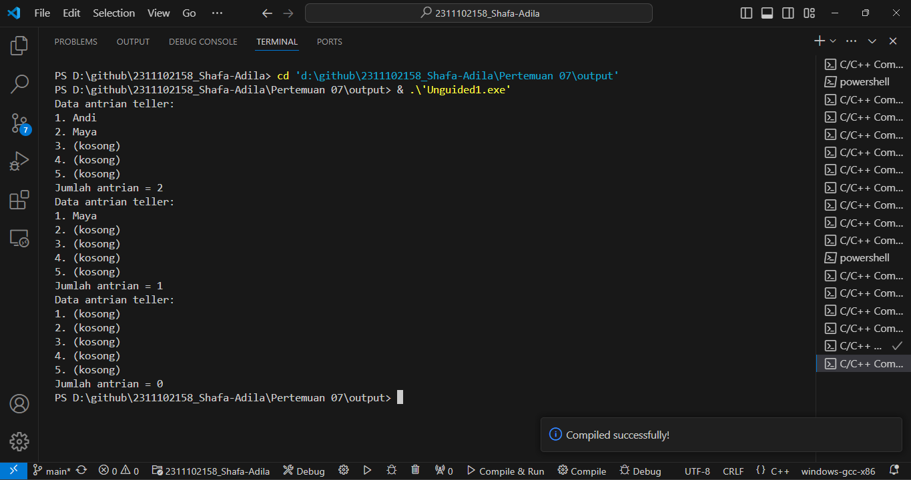
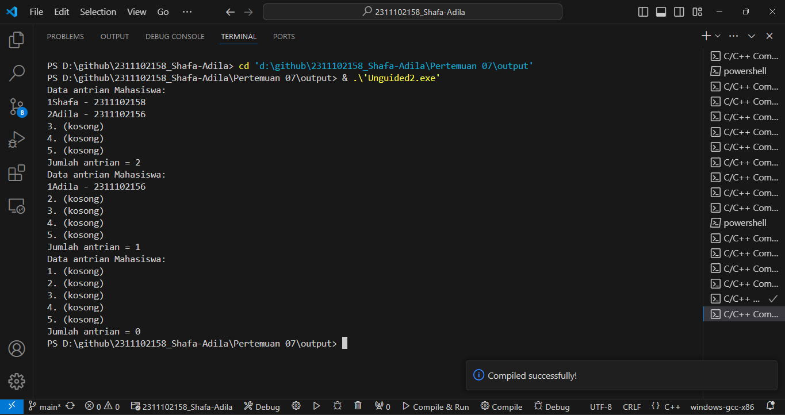

# <h1 align="center">Laporan Praktikum Modul Queue</h1>
<p align="center">Shafa Adila Santoso - 2311102158</p>

## Dasar Teori

Queue atau antrian merupakan kumpulan elemen dengan penyisipan dan penghapusan elemen yang dilakukan dari sisi/gerbang ynag berbeda. Kebalikan dari stack, queue (antrian) adalah suatu jenis struktur data yang dapat diproses dengan sifat FIFO (First In First Out), dimana elemen yang pertama kali masuk ke antrian akan keluar pertama kalinya. Untuk cara kerja dari FIFO ii sama halnya dengan jejeran orang yang sedang menunggu antrean disupermarket dimana orang pertama yang datang adalah orang yang pertama dilayani (First In, First Out). Pada struktur data ini, urutan pertama disebut dnegan Front atau Head. Sebaliknya, data pada urutan terakhir disebut dengan Back, Rear atau Tail. Sedangkan proses untuk menambahkan data pada antrean disebut dengan Enqueue dan proses untuk menghapus data dari antrean disebut dengan Dequeue.
Queue memiliki peran yang penting dalam berbagai aplikasi dan algoritma. Salah satu fungsi utamanya adalah mengatur dan mengelola antrean tugas atau operasi secara efisien. Dalam sistem komputasi, ia digunakan untuk menangani tugas-tugas seperti penjadwalan proses, antrean pesan, dan manajemen sumber daya.
Operasi pada Queue;
1.	enqueue() :menambahkandatakedalamqueue. 
2.	dequeue() :mengeluarkandatadariqueue. 
3.	peek() :mengambildatadariqueuetanpamenghapusnya. 
4.	isEmpty() :mengecekapakahqueuekosongatautidak. 
5.	isFull() :mengecekapakahqueuepenuhatautidak. 
6.	size() :menghitungjumlahelemendalamqueue.


## Guided 

### 1. [Program Queue]

```C++
 #include <iostream>
 using namespace std;

 const int maksimalQueue = 5; //Maksimalantrian
 int front = 0;//Penandaantrian
 int back = 0; //Penanda
 string queueTeller[5];//Fungsipengecekan
 
 bool isFull() { //Pengecekanantrianpenuhatautidak
    if (back == maksimalQueue) {
        return true; // =1
    } else {
        return false;
    }
 }

 bool isEmpty() { //Antriannyakosongatautidak
    if (back == 0) {
        return true;
    } else {
        return false;
    }
 }

 void enqueueAntrian(string data) { //Fungsimenambahkanantrian
    if (isFull()) {
        cout << "Antrian penuh" << endl;
    } else {
        if (isEmpty()) { //Kondisiketikaqueuekosong
        queueTeller[0] = data;
        front++;
        back++;
        } else { //Antrianya ada isi
            queueTeller[back] = data;
            back++;
        }
    }
 }

 void dequeueAntrian() { //Fungsi mengurangi antrian
    if (isEmpty()) {
        cout << "Antrian kosong" << endl;
    } else {
        for (int i = 0; i < back; i++) {
            queueTeller[i] = queueTeller[i + 1];
        }
        back--;
    }
 }

 int countQueue() { //Fungsi menghitung banyak antrian
    return back;
 }
    void clearQueue() {//Fungsi menghapus semua antrian
    if (isEmpty()) {
        cout << "Antrian kosong" << endl;
    } else {
        for (int i = 0; i < back; i++) {
            queueTeller[i] = "";
        }
        back = 0;
        front = 0;
    }
 }
 
 void viewQueue() { //Fungsi melihat antrian
    cout << "Data antrian teller:" << endl;
    for (int i = 0; i < maksimalQueue; i++) {
        if (queueTeller[i] != "") {
            cout << i + 1 << ". " << queueTeller[i] << endl;
        } else {
            cout << i + 1 << ". (kosong)" << endl;
        }
    }
 }

 int main() {
    enqueueAntrian("Andi");
    enqueueAntrian("Maya");
    viewQueue();
    cout << "Jumlah antrian = " << countQueue() << endl;
    dequeueAntrian();
    viewQueue();
    cout << "Jumlah antrian = " << countQueue() << endl;
    clearQueue();
    viewQueue();
    cout << "Jumlah antrian = " << countQueue() << endl;
    return 0;
 }
```
Program diatas adalam program c++ yang mengimplementasikan sistem queue (antrian) menggunakan array. Program ini terdiri dari beberapa fungsi utama, yang pertama ada fungsi “isFull” untuk mengecek apakah antrian penuh atau tidak. Yang kedua terdapat fungsi “isEmpty” untuk mengecek apakah antrian kosong atau tidak. Yang ketiga terdapat fungsi “enqueueAntrian” untuk menambahkan elemen baru ke dalam antrian. Yang keempat terdapat fungsi “dequeueAntrian” untk menghapus elemen dari antrian. Yan kelima terdapat fungsi “countQueue” untuk menghapus semua elemen dalam antrian. Yang keeneam terdapat fungsi “viewQueue” untuk menampilkan elemen elemen dalam antrian. Kemudian pada fungsi “main()” dalam program tersebut berisi beberapa operasi dimulai dari menambahkan elemen “Andi” dan “Maya” kedalam antrian, kemudian menampilkan jumlah antriannya. Selanjutnya menghapus satu elemen dar antrian, isi antrian ditampilkan kembali dan jumlah elemen dihitung lagi. Operasi terakhir, menghapus smeua elemen dalam antrrian kemudian ditampilkan kembali dan dihitung kembali jumlah elemennya. Selanjutnya hasil akan ditampilkan pada output.

## Unguided 

### 1. [Ubahlah penerapan konsep queue pada bagian guided dari array menjadi linked list]

```C++
#include <iostream> // Library untuk input-output
using namespace std;

struct Node { // Deklarasi struktur Node untuk linked list
    string data_158; // Data yang disimpan dalam simpul
    Node* next; // Pointer ke simpul berikutnya
};

Node* front = nullptr; // Pointer ke simpul pertama dalam antrian
Node* back = nullptr; // Pointer ke simpul terakhir dalam antrian

bool isEmpty() { // Fungsi untuk memeriksa apakah antrian kosong
    return front == nullptr; // Kembalikan true jika front bernilai nullptr
}

void enqueueAntrian(string data) { // Fungsi untuk menambahkan data ke antrian
    Node* newNode = new Node; // Buat simpul baru
    newNode->data_158 = data; // Isi data simpul dengan data yang diberikan
    newNode->next = nullptr; // Set pointer next menjadi nullptr
    if (isEmpty()) { // Jika antrian kosong
        front = back = newNode; // Jadikan simpul baru sebagai front dan back
    } else { // Jika antrian tidak kosong
        back->next = newNode; // Tautkan simpul baru di belakang
        back = newNode; // Perbarui pointer back
    }
}

void dequeueAntrian() { // Fungsi untuk menghapus data dari antrian
    if (isEmpty()) { // Jika antrian kosong
        cout << "Antrian kosong" << endl; // Tampilkan pesan kesalahan
    } else {
        Node* temp = front; // Simpan pointer ke simpul pertama
        front = front->next; // Geser front ke simpul berikutnya
        delete temp; // Hapus simpul pertama
    }
}

int countQueue() { // Fungsi untuk menghitung jumlah data dalam antrian
    int count = 0; // Variabel untuk menyimpan jumlah data
    Node* temp = front; // Pointer sementara untuk traversal
    while (temp != nullptr) { // Selama belum mencapai akhir antrian
        count++; // Tambahkan jumlah data
        temp = temp->next; // Geser ke simpul berikutnya
    }
    return count; // Kembalikan jumlah data
}

void clearQueue() { // Fungsi untuk menghapus semua data dalam antrian
    while (!isEmpty()) { // Selama antrian belum kosong
        dequeueAntrian(); // Hapus data pertama dalam antrian
    }
}

void viewQueue() { // Fungsi untuk menampilkan isi antrian
    cout << "Data antrian teller:" << endl; // Tampilkan judul
    Node* temp = front; // Pointer sementara
    int i = 1; // Variabel untuk nomor antrian
    while (temp != nullptr) { // Selama belum mencapai akhir antrian
        cout << i << ". " << temp->data_158 << endl; // Tampilkan nomor dan data
        temp = temp->next; // Geser ke simpul berikutnya
        i++;
    }
    for (; i <= 5; i++) { // Tampilkan "kosong" untuk slot yang tidak terisi
        cout << i << ". (kosong)" << endl;
    }
}

int main() {
    enqueueAntrian("Andi"); // Menambahkan data "Andi" ke antrian
    enqueueAntrian("Maya"); // Menambahkan data "Maya" ke antrian
    viewQueue(); // Menampilkan isi antrian
    cout << "Jumlah antrian = " << countQueue() << endl; // Menampilkan jumlah data dalam antrian
    dequeueAntrian(); // Hapus data pertama dari antrian
    viewQueue(); // Menampilkan isi antrian setelah penghapusan
    cout << "Jumlah antrian = " << countQueue() << endl; // Menampilkan jumlah data dalam antrian
    clearQueue(); // Hapus semua data dalam antrian
    viewQueue(); // Menampilkan isi antrian setelah penghapusan semua data
    cout << "Jumlah antrian = " << countQueue() << endl; // Menampilkan jumlah data dalam antrian
    return 0; // Kembalikan nilai 0 untuk menandakan program berakhir dengan sukses
}
```
#### Output:


Program diatas adalah program sederhana c++ yang mengimplementasikan sistem queue dnegan linked list. Program ini  dimulai dengan menggunakan library “iostream” dan namespace “std”. Kemudian struktur “node” didefinisikan utnuk menempatkan simpul dalam linked list. Steiap simpul terdiri dari dua bagian yaitu “data_158” untuk menyimpan data dan “next” sebagai pointer kesimpul berikutnya. Kmudian terdapat dua pointer yaitu “front” dan “back” yang digunakan untuk menandai simpul pertama dan terakhir dalam antrian. Selanjutnya program ini emiliki beberapa fungsi utama seperti, sungsi “isEmpty” yang digunakan untuk memeriksa apakah antrian kososng dengan memeriksa apakah “front” bernilai “nullptr” atau tidak. Fungsi “enqueueAntrian” pada programmenambahkan elemen baru ke dalam antrian, jika kosong maka simpul menjadi “front” dann “back”. Tetapi jika tidak maka simpul baru akan ditambahkan kebelakang antrian dan pointer “back” diperbarui. Fungsi “dequeueAntrian” menghapus elemen dari antrian yangn mana jika antrian kosong fungsi menampilkan pesan dan jika tidak fungsi akan menggeser “front” kesimpul berikutnya. Fungsi “countQueue” untuk menghitung jumlah elemen dalam antrian. Fungsi “clearQueue” untuk menghapus semua elemen dalam antrian dengan memanggil “dequeueAntrian” berulang kali hingga antrian kosong. Fungsi “viewQueur” utnuk menampilkan isi antrian dimana tiap elemennya ditampilkan dnegna urut dan jika elemen kurang dari 5 maka sisanya ditampilkan sebagai “(kososng)”. Yang terakhir yterdapat fungsi “main()”, pada fungsi main ini akan menambahkan elemen “Andi” dan “Maya” kedalam antrian, kemudian menampilkan jumlah antriannya. Selanjutnya menghapus satu elemen dar antrian, isi antrian ditampilkan kembali dan jumlah elemen dihitung lagi. Operasi terakhir, menghapus smeua elemen dalam antrrian kemudian ditampilkan kembali dan dihitung kembali jumlah elemennya. Selanjutnya hasil akan ditampilkan pada output.

### 2. [Dari nomor 1 buatlah konsep antri dengan atribut Nama mahasiswa dan NIM Mahasiswa]

```C++
#include <iostream> // Library untuk input-output
using namespace std;

struct Node { // Deklarasi struktur Node untuk linked list
    string nama_158; // Data yang disimpan dalam simpul
    string nim_158; // Data yang disimpan dalam simpul
    Node* next; // Pointer ke simpul berikutnya
};

Node* front = nullptr; // Pointer ke simpul pertama dalam antrian
Node* back = nullptr; // Pointer ke simpul terakhir dalam antrian

bool isEmpty() { // Fungsi untuk memeriksa apakah antrian kosong
    return front == nullptr; // Kembalikan true jika front bernilai nullptr
}

void enqueueAntrian(string nama_158, string nim_158) { // Fungsi untuk menambahkan data ke antrian
    Node* newNode = new Node; // Buat simpul baru
    newNode->nama_158 = nama_158; // Isi data simpul dengan nama_158 yang diberikan
    newNode->nim_158 = nim_158; // Isi data simpul dengan nim_158 yang diberikan
    newNode->next = nullptr; // Set pointer next menjadi nullptr
    if (isEmpty()) { // Jika antrian kosong
        front = back = newNode; // Jadikan simpul baru sebagai front dan back
    } else { // Jika antrian tidak kosong
        back->next = newNode; // Tautkan simpul baru di belakang
        back = newNode; // Perbarui pointer back
    }
}

void dequeueAntrian() { // Fungsi untuk menghapus data dari antrian
    if (isEmpty()) { // Jika antrian kosong
        cout << "Antrian kosong" << endl; // Menampilkan pesan kesalahan
    } else {
        Node* temp = front; // Simpan pointer ke simpul pertama
        front = front->next; // Geser front ke simpul berikutnya
        delete temp; // Hapus simpul pertama
    }
}

int countQueue() { // Fungsi untuk menghitung jumlah data dalam antrian
    int count = 0; // Variabel untuk menyimpan jumlah data
    Node* temp = front; // Pointer sementara untuk traversal
    while (temp != nullptr) { // Selama belum mencapai akhir antrian
        count++; // Menambahkan jumlah data
        temp = temp->next; // Geser ke simpul berikutnya
    }
    return count; // Kembalikan jumlah data
}

void clearQueue() { // Fungsi untuk menghapus semua data dalam antrian
    while (!isEmpty()) { // Selama antrian belum kosong
        dequeueAntrian(); // Hapus data pertama dalam antrian
    }
}

void viewQueue() { // Fungsi untuk menampilkan isi antrian
    cout << "Data antrian Mahasiswa:" << endl; // Menampilkan judul
    Node* temp = front; // Pointer sementara untuk traversal
    int i = 1; // Variabel untuk nomor antrian
    while (temp != nullptr) { // Selama belum mencapai akhir antrian
        cout << i << temp->nama_158 << " - " << temp->nim_158 << endl; // Menampilkan nomor dan data
        temp = temp->next; // Geser ke simpul berikutnya
        i++; // Tingkatkan nomor antrian
    }
    for (; i <= 5; i++) { // Menampilkan "kosong" untuk slot yang tidak terisi
        cout << i << ". (kosong)" << endl;
    }
}

int main() {
    enqueueAntrian("Shafa", "2311102158"); // Menambahkan data "Andi" ke antrian
    enqueueAntrian("Adila", "2311102156"); // Menambahkan data "Adila" ke antrian
    viewQueue(); // Menampilkan isi antrian
    cout << "Jumlah antrian = " << countQueue() << endl; // Menampilkan jumlah data dalam antrian
    dequeueAntrian(); // Hapus data pertama dari antrian
    viewQueue(); // Menampilkan isi antrian setelah penghapusan
    cout << "Jumlah antrian = " << countQueue() << endl; // Menampilkan jumlah data dalam antrian
    clearQueue(); // Hapus semua data dalam antrian
    viewQueue(); // Menampilkan isi antrian setelah penghapusan semua data
    cout << "Jumlah antrian = " << countQueue() << endl; // Menampilkan jumlah data dalam antrian
    return 0; // Kembalikan nilai 0 untuk menandakan program berakhir dengan sukses
}
```
#### Output:


Program diatas adalah program sederhana c++ yang mengimplementasikan sistem queue dnegan linked list. Program ini  dimulai dengan menggunakan library “iostream” dan namespace “std”. Kemudian Struktur Node digunakan untuk menyimpan data mahasiswa (nama dan NIM) serta pointer next yang menunjuk ke simpul berikutnya dalam antrian. Selanjutnya program ini emiliki beberapa fungsi utama seperti, sungsi “isEmpty” yang digunakan untuk memeriksa apakah antrian kososng dengan memeriksa apakah “front” bernilai “nullptr” atau tidak. Fungsi “enqueueAntrian” pada programmenambahkan elemen baru ke dalam antrian, jika kosong maka simpul menjadi “front” dann “back”. Tetapi jika tidak maka simpul baru akan ditambahkan kebelakang antrian dan pointer “back” diperbarui. Fungsi “dequeueAntrian” menghapus elemen dari antrian yangn mana jika antrian kosong fungsi menampilkan pesan dan jika tidak fungsi akan menggeser “front” kesimpul berikutnya. Fungsi “countQueue” untuk menghitung jumlah elemen dalam antrian. Fungsi “clearQueue” untuk menghapus semua elemen dalam antrian dengan memanggil “dequeueAntrian” berulang kali hingga antrian kosong. Fungsi “viewQueur” utnuk menampilkan isi antrian dimana tiap elemennya ditampilkan dnegna urut dan jika elemen kurang dari 5 maka sisanya ditampilkan sebagai “(kososng)”. Yang terakhir yterdapat fungsi “main()”, pada fungsi main ini akan menambahkan elemen “Shafa” dan “Adila” kedalam antrian, kemudian menampilkan jumlah antriannya. Selanjutnya menghapus satu elemen dar antrian, isi antrian ditampilkan kembali dan jumlah elemen dihitung lagi. Operasi terakhir, menghapus smeua elemen dalam antrrian kemudian ditampilkan kembali dan dihitung kembali jumlah elemennya. Selanjutnya hasil akan ditampilkan pada output.

## Kesimpulan
Dengan diadakannya praktikum ini dapat membantu mahasiswa dalam menjelaskan definisi dan konsep dari double queue serta menerapkan operasi tambah, hapus, dan tampil data pada queue[1].

## Referensi
[1] Erkamim, E., Abdurrohim, I., Yuliyanti, S., Karim, R., Rahman, A., Admira, T. M. A., & Ridwan, A. (2024). Buku Ajar Algoritma dan Struktur Data. PT. Sonpedia Publishing Indonesia.</br>
[2] Sihombing, J., “Penerapan stack dan queue pada array dan linked list dalam java,” INFOKOM, vol. 7(2), 15-24, Desember, 2019.</br>