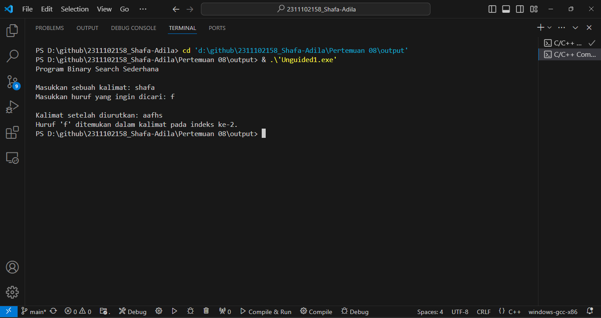
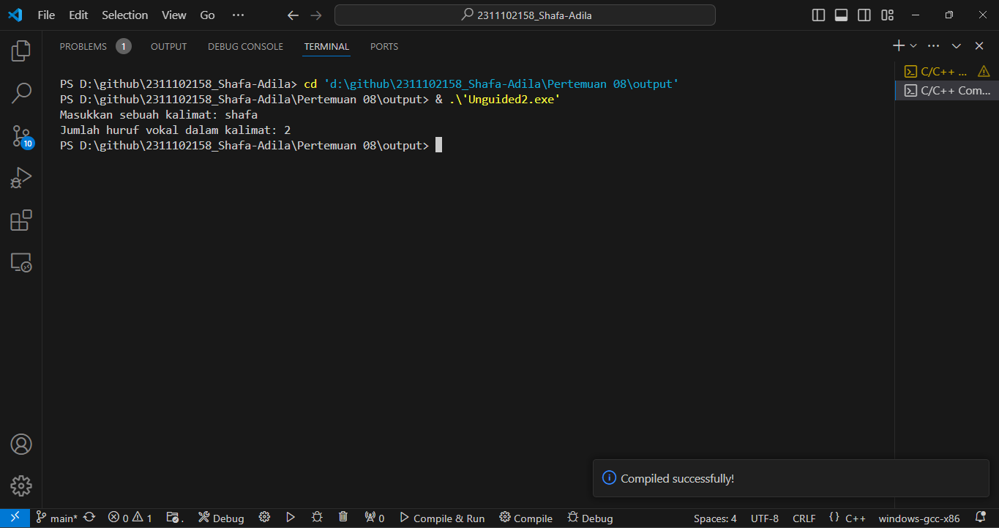
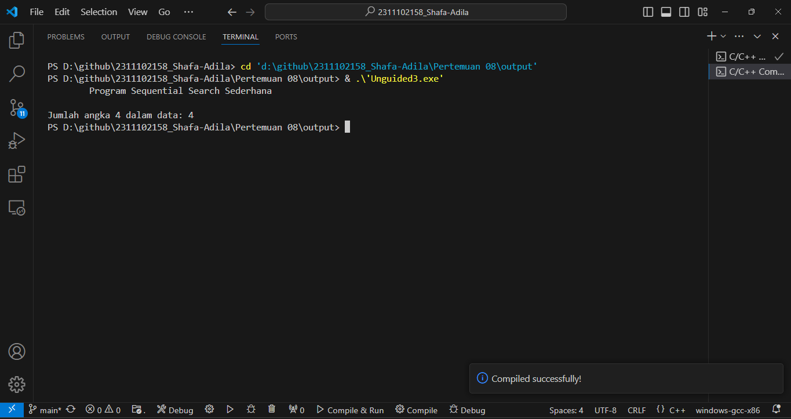

# <h1 align="center">Laporan Praktikum Modul Algoritma Searching</h1>
<p align="center">Shafa Adila Santoso - 2311102158</p>

## Dasar Teori

Searching merupakan proses menemukan nilai (data) tertentu didalam sekumpulan data yang bertipe sama (baik bertipe dasar maupun bertipe bentukan). Tujuan utama dari searching sendiri adalah untuk mengidentifikasi keberadaan dan posisi elemen tertentu dalam struktur data seperti array, list, database, atau struktur data lainnya.
1.	Sequential seraching
Sequential Search merupakan algoritma pencarian data yang digunakan untuk data dengan pola acak atau belum terurut, teknik pencarian data dilakukan secara urut dari depan ke belakang atau dari awal sampai akhir berdasarkan key yang dicari dalam array 1 dimensi. Data yang akan dicari nanti akan ditelusuri dalam semua elemen-elemen array dari awal sampai akhir, dan data yang dicari tersebut tidak perlu diurutkan terlebih dahulu apabila sampai akhir pengulangan tidak ada data yang sama. Konsep dari Sequential search ini sendiri merupakan sebuah metode pencarian di dalam sebuah array di mana setiap elemen dibandingkan satu per satu secara berurutan. Proses pencarian ini dimulai dari indeks pertama, kemudian dilanjutkan hingga ke indeks terakhir array. Pencarian akan berhenti begitu data yang dicari telah ditemukan, atau terus berlanjut hingga semua elemen array telah diperiksa. Jika data tidak ditemukan setelah seluruh elemen diperiksa, maka proses pencarian akan dihentikan. Dalam pencarian ini, jumlah perulangan yang terjadi adalah sebanyak N elemen dalam array, di mana N adalah panjang dari array tersebut. Dengan demikian, waktu pencarian bergantung secara langsung pada ukuran array.
Algoritma pencarian berurutan dapat dituliskan sebagai berikut : 
a.	i←0 2 ketemu ←false 
b.	Selama (tidak ketemu) dan (i <= N) kerjakan baris 4 
c.	Jika (Data[i] = x) maka ketemu ← true, jika tidak i ← i + 1 
d.	Jika (ketemu) maka i adalah indeks dari data yang dicari, jika tidak data tidak ditemukan.
2.	Binary Search
Pencarian   Biner (binary Search) adalah metode pencarian data pada array yang telah terurut, metode ini lebih effisien dari pada metode pencarian linier dimana semua elemen di dalam array diuji satu persatu sampai ditemukan elemen yang diinginkan. Algoritma ini bekerja dengan cara memilih record dengan indeks tengah dari tabel dan membandingkannya dengan record yang hendak dicari. Jika record tersebut lebih rendah atau lebih tinggi, maka tabel tersebut dibagi dua dan bagian tabel yang bersesuaian akan diproses kembali secara rekursi. Konsep dari binary search ini sendiri yaitu, Data akan diambil dari posisi 1 sampai posisi akhir N. Kemudian, data akan dibagi menjadi dua untuk mendapatkan posisi data tengah. Selanjutnya, data yang dicari akan dibandingkan dengan data yang berada di posisi tengah untuk menentukan apakah data tersebut lebih besar atau lebih kecil. Apabila data yang dicari lebih besar dari data tengah, maka dapat dipastikan bahwa data tersebut kemungkinan berada di sebelah kanan dari data tengah. Proses pencarian selanjutnya akan dilakukan dengan membagi data menjadi dua bagian pada bagian kanan, dengan posisi data tengah menjadi posisi awal untuk pembagian tersebut. Sebaliknya, apabila data yang dicari lebih kecil dari data tengah, maka data tersebut kemungkinan berada di sebelah kiri dari data tengah. Proses pencarian akan dilakukan dengan membagi data menjadi dua bagian pada bagian kiri, dengan posisi data tengah menjadi posisi akhir untuk pembagian selanjutnya. Jika data belum ditemukan, pencarian akan dilanjutkan dengan kembali membagi data menjadi dua. Namun, apabila data bernilai sama dengan data tengah, maka data yang dicari langsung ditemukan dan pencarian dihentikan. 
Algoritma pencarian biner dapat dituliskan sebagai berikut : 
a.	L 0 
b.	R N–1 
c.	ketemu false
d.	Selama (L <= R) dan (tidak ketemu) kerjakan baris 5 sampai dengan 8
e.	m (L+R)/2
f.	Jika (Data[m] = x) maka ketemu true
g.	Jika (x < Data[m]) maka R m– 1
h.	Jika (x > Data[m]) maka L m +1
i.	Jika (ketemu) maka m adalah indeks dari data yang dicari, jika tidak data tidak ditemukan


## Guided 

### 1. [Buatlah sebuah project dengan menggunakan sewuential search sederhana untuk melakukan pencarian data]

```C++
#include <iostream>
using namespace std;

int main(){
    int n = 10; // Mendefinisikan ukuran array
    int data[n] = {9,4,1,7,5,12,4,13,4,10}; // Inisialisasi array dengan data
    int cari = 10; // Angka yang akan dicari
    bool ketemu = false; // Variabel penanda apakah angka ditemukan
    int i; // Variabel untuk iterasi dalam loop

    //Algoritma Sequential Search
    for ( i=0; i<n; i++ ) {
        if (data[i] == cari) {
            ketemu = true;
            break; // Jika nilai ditemukan, keluar dari loop
        }
    }

    // Menampilkan output
    cout<<"\tProgram Sequential Search Sederhana\n"<<endl;
    cout<<"data:{9,4,1,7,5,12,4,13,4,10}"<<endl;
    if(ketemu){
        cout<<"\nAngka"<<cari<<"ditemukanpadaindekske-"<<i<<endl;
    }else{
        cout << cari << " tidak dapat ditemukan pada data." <<endl;
    }
    return 0;
 }
```
Program di atas adalah program c++ yang mengimplementasikan penggunaan dari sequential search. Program Dimulai dengan mendeklarasikan variabel dan array, kemudian program akan mencari nilai tertentu dalam array “data”. Melalui setiap elemen array, algortitma iterasi akan memeriksa kesesuaian dengan nilai yang dicari (“cari”). Jika ditemukan, maka perulangan akan berhenti dan program akan mencatat bahwa nilai telah ditemukan. Setelah pencarian, program akan menampilkan hasilnya, jika nilai ditemukan, program akan menampilkan output berupa indeksnya. Tetapi jika tidak, program akan mnenampilkan pesan bahwa nilai tidak ditemukan. Program diakhiri dengan “return 0”, menandakan sukses. Beberapa perbaikan pada format output dilakukan untuk membuat pesan lebih jelas dan informatif.

### 2. [Buatlah sebuah project untuk melakukan pencarian data dengan menggunakan Binary Search]

```C++
#include <iostream> // Library untuk input-output stream
#include <conio.h>
#include <iomanip> // Library untuk manipulasi output
using namespace std;

int dataArray[7] = {1,8,2,5,4,9,7}; // Array yang akan diurutkan dan dicari
int cari; // Variabel untuk menyimpan nilai yang ingin dicari

void selection_sort(){ // Fungsi untuk melakukan selection sort
    int temp,min,i,j;
    for(i=0;i<7;i++){ // Looping untuk setiap elemen di array
        min=i; // Menginisialisasi nilai minimum
        for(j=i+1;j<7;j++){ // Looping untuk mencari nilai minimum di sub-array
            if(dataArray[j]<dataArray[min]){ // Jika ditemukan nilai yang lebih kecil
                min=j; // Simpan indeks nilai minimum
            }
        }
        temp=dataArray[i]; // Tukar nilai
        dataArray[i]=dataArray[min];
        dataArray[min]=temp;
    }
}

void binarySearch () { // Fungsi untuk pencarian biner
    int awal,akhir,tengah; // Variabel untuk indeks awal, akhir, dan tengah
    bool b_flag=false; // Flag untuk menandai apakah nilai ditemukan atau tidak
    awal=0; // Inisialisasi indeks awal
    akhir=6; // Inisialisasi indeks akhir (6 karena array berindeks dari 0 hingga 6)
    while(!b_flag&&awal<=akhir){ // Selama nilai belum ditemukan dan masih ada elemen yang belum diperiksa
        tengah=(awal+akhir)/2; // Hitung indeks tengah
        if(dataArray[tengah]==cari){ // Jika nilai ditemukan di tengah
            b_flag=true; // Set flag menjadi true
        }else if(dataArray[tengah]<cari){ // Jika nilai yang dicari lebih besar dari nilai di tengah
            awal=tengah+1; // Ubah indeks awal
        }else{ // Jika nilai yang dicari lebih kecil dari nilai di tengah
            akhir=tengah-1; // Ubah indeks akhir
        }
    }
    if (b_flag) // Jika nilai ditemukan
    {
        cout << "\nData ditemukan pada index ke- " << tengah << endl; // Tampilkan indeks tempat nilai ditemukan
    } else { // Jika nilai tidak ditemukan
        cout << "\nDATA TIDAK DITEMUKAN" << endl; // Tampilkan pesan bahwa nilai tidak ditemukan
    }
}

int main() { // Fungsi utama
    cout << "BINARY SEARCH" << endl; // Tampilkan judul program

    cout << "\nData : "; // Tampilkan pesan untuk data awal

    for (int x = 0; x < 7; x++) // Looping untuk menampilkan data awal
    {
        cout << setw(3) << dataArray[x]; // Tampilkan data dengan lebar 3 karakter
    }
    cout << endl; // Pindah baris

    cout << "Masukkan Data yang ingin dicari : "; // Tampilkan pesan untuk input data yang dicari
    cin >> cari; // Masukkan nilai yang dicari

    cout << "\nData diurutkan: "; // Tampilkan pesan untuk data yang diurutkan
    selection_sort(); // Panggil fungsi untuk mengurutkan data

    for (int x = 0; x < 7; x++) // Looping untuk menampilkan data yang sudah diurutkan
    {
        cout << setw(3) << dataArray[x]; // Tampilkan data dengan lebar 3 karakter
    }
    cout << endl; // Pindah baris
    binarySearch(); // Panggil fungsi untuk melakukan pencarian biner
    _getche(); // Tunggu input sebelum menutup program
    return 0; // Kembalikan nilai 0 untuk menandakan bahwa program berakhir dengan sukses
}
```
program diatas adalah program c++ yang mengimplementasikan penggunaan dari binary search. Pertama, array “dataArray” dengan 7 elemen diinisialisasi bersama variabel "cari" yang akan menyimpan nilai yang dicari. Fungsi "selection_sort" digunakan untuk mengurutkan array dengan mencari elemen terkecil dari elemen yang belum diurutkan dan menukarnya dengan elemen di posisi saat ini. Setelah data diurutkan, fungsi "binarySearch" digunakan untuk mencari nilai dalam array yang telah diurutkan. Algoritma pencarian biner ini menetapkan indeks awal, tengah, dan akhir, dan menyesuaikan indeks berdasarkan perbandingan nilai tengah dengan nilai yang dicari sampai nilai ditemukan atau rentang pencarian habis.
Pada fungsi utama, program menampilkan data awal dan meminta pengguna memasukkan nilai yang ingin dicari. Data kemudian diurutkan menggunakan "selection_sort" dan hasilnya ditampilkan. Selanjutnya, pencarian biner dilakukan menggunakan "binarySearch" dan hasil pencarian ditampilkan, menunjukkan apakah nilai ditemukan dan pada indeks berapa. Program diakhiri dengan mengembalikan nilai 0, menandakan bahwa program berakhir dengan sukses.


## Unguided 

### 1. [SBuatlah sebuah program untuk mencari sebuah huruf pada sebuah kalimat yang sudah di input dengan menggunakan Binary Search!]

```C++
#include <iostream>
#include <algorithm>
#include <string>
using namespace std;

// Fungsi untuk melakukan binary search pada array karakter
int binarySearch(char arr[], int size, char key) {
    int kiri_158 = 0;
    int kanan_158 = size - 1;

    while (kiri_158 <= kanan_158) {
        int mid = kiri_158 + (kanan_158 - kiri_158) / 2;
        // Jika elemen ditemukan pada tengah
        if (arr[mid] == key)
            return mid;
        // Jika elemen lebih besar, abaikan bagian kiri_158
        if (arr[mid] < key)
            kiri_158 = mid + 1;
        // Jika elemen lebih kecil, abaikan bagian kanan_158
        else
            kanan_158 = mid - 1;
    }

    // Elemen tidak ditemukan
    return -1;
}

int main() {
    string kalimat;
    char cariKarakter;

    cout<<"Program Binary Search Sederhana\n"<<endl;
    // User diminta menginputkan kalimat
    cout << "Masukkan sebuah kalimat: ";
    getline(cin, kalimat);

    // User diminta menginputkan huruf yang akan dicari
    cout << "Masukkan huruf yang ingin dicari: ";
    cin >> cariKarakter;
    cout << endl;

    // Konversi string ke array karakter dan urutkan
    int n = kalimat.length();
    char arr[n];
    for (int i = 0; i < n; ++i) {
        arr[i] = kalimat[i];
    }
    sort(arr, arr + n); // Mengurutkan array karakter

    // Mencetak array karakter yang telah diurutkan
    cout << "Kalimat setelah diurutkan: ";
    for (int i = 0; i < n; ++i) {
        cout << arr[i];
    }
    cout << endl;

    // Melakukan binary search pada array karakter
    int index = binarySearch(arr, n, cariKarakter);

    if (index != -1) {
        cout << "Huruf '" << cariKarakter << "' ditemukan dalam kalimat pada indeks ke-" << index << "." << endl;
    } else {
        cout << "Huruf '" << cariKarakter << "' tidak ditemukan dalam kalimat." << endl;
    }

    return 0;
}
```
#### Output:


Program ini adalah program c++ yang mengimplementasikan penggunaan dari binary search yang digunakan untuk mencari keberadaan sebuah huruf dalam sebuah kalimat. Pertama-tama, program meminta pengguna untuk memasukkan sebuah kalimat dan huruf yang ingin dicari. Setelah menerima input, program mengonversi kalimat tersebut menjadi sebuah array karakter dan mengurutkannya menggunakan algoritma pengurutan. Selanjutnya, program melakukan pencarian huruf yang dimasukkan pengguna dalam array yang telah diurutkan menggunakan binary search. Jika huruf ditemukan, program akan menampilkan indeks di mana huruf tersebut ditemukan dalam kalimat yang diurutkan. Namun, jika huruf tidak ditemukan, program akan memberi tahu pengguna bahwa huruf tersebut tidak ditemukan dalam kalimat.


### 2. [SoaBuatlah sebuah program yang dapat menghitung banyaknya huruf vocal dalam sebuah kalimat!l]

```C++
#include <iostream>
#include <string>

using namespace std;

// Fungsi untuk mengecek apakah sebuah karakter adalah huruf vokal
bool isVowel(char ch) {
    ch = tolower(ch); // Mengubah karakter menjadi huruf kecil untuk memudahkan pengecekan
    return (ch == 'a' || ch == 'e' || ch == 'i' || ch == 'o' || ch == 'u');
}

int main() {
    string input;
    int vowelCount = 0;

    // Memasukkan kalimat
    cout << "Masukkan sebuah kalimat: ";
    getline(cin, input);

    // Sequential Search untuk menghitung jumlah huruf vokal
    for (int i = 0; i < input.length(); ++i) {
        if (isVowel(input[i])) {
            ++vowelCount;
        }
    }

    // Menampilkan hasil
    cout << "Jumlah huruf vokal dalam kalimat: " << vowelCount << endl;

    return 0;
}
```
#### Output:


Program di atas adalah program C++ yang mengimplementasikan penggunaan dari sequential search yang digunakan untuk menghitung jumlah huruf vokal dalam sebuah kalimat yang dimasukkan oleh pengguna. Program ini menggunakan dua library utama, yaitu "iostream" untuk menangani input dan output, serta “string” untuk menangani objek string. Program dimulai dengan mendefinisikan fungsi “isVowel” yang bertugas untuk mengecek apakah sebuah karakter adalah huruf vokal. Fungsi ini mengubah karakter menjadi huruf kecil untuk memudahkan pengecekan, kemudian memeriksa apakah karakter tersebut termasuk dalam huruf vokal ('a', 'e', 'i', 'o', 'u'). Kemudian pada fungsi “main”, program mendeklarasikan variabel “input” untuk menyimpan kalimat yang dimasukkan oleh pengguna dan “vowelCount” untuk menghitung jumlah huruf vokal dalam kalimat tersebut. Program tersebut meminta pengguna untuk memasukkan sebuah kalimat dengan menggunakan. Selanjutnya, program melakukan iterasi melalui setiap karakter dalam kalimat menggunakan loop “for” dan memeriksa setiap karakter menggunakan fungsi “isVowel”. Jika karakterm merupakan huruf vokal, maka “vowelCount” akan bertambah satu. Setelah loop selesai, program akan menampilkan jumlah huruf vokal dalam kalimat pada output.


### 3. [SoalDiketahui data = 9, 4, 1, 4, 7, 10, 5, 4, 12, 4. Hitunglah berapa banyak angka 4 dengan menggunakan algoritma Sequential Search!]

```C++
#include <iostream>
using namespace std;

int main() {
    // Data yang diberikan
    int data_158[] = {9, 4, 1, 4, 7, 10, 5, 4, 12, 4}; // Array integer yang berisi data
    int size = sizeof(data_158) / sizeof(data_158[0]); // Menghitung jumlah elemen dalam array
    int angka = 4;  // Angka yang akan dihitung
    int count = 0; // Variabel untuk menyimpan jumlah kemunculan angka 4

    // Sequential Search untuk menghitung jumlah angka 4
    for (int i = 0; i < size; ++i) { // Looping melalui setiap elemen dalam array
        if (data_158[i] == angka) { // Jika elemen saat ini sama dengan angka yang dicari
            ++count; // Tambahkan jumlah kemunculan angka
        }
    }

    // Menampilkan hasil
    cout<<"\tProgram Sequential Search Sederhana\n"<<endl; // Pesan judul program
    cout << "Jumlah angka " << angka << " dalam data: " << count << endl; // Menampilkan jumlah kemunculan angka

    return 0;
}
```
#### Output:


Program di atas adalah program C++ yang mengimplementasikan penggunaan dari sequential search yang digunakan untuk menghitung jumlah kemunculan angka tertentu dalam sebuah array menggunakan metode pencarian berurutan. Program tersebut menggunakan library “iostream” untuk input dan output. Pertama, program akan mendeklarasikan dan menginisialisasi beberapa variabel, termasuk array “data” yang berisi sepuluh angka, variabel “size” untuk menghitung ukuran array, variabel “angka” yang menunjukkan angka yang akan dihitung kemunculannya (yaitu angka 4), dan variabel “count” untuk menyimpan jumlah kemunculan angka tersebut. Selanjutnya, program melakukan iterasi melalui setiap elemen dalam array menggunakan loop “for”, dan dalam setiap iterasi, program memeriksa apakah elemen array sama dengan angka yang dicari (“angka”). Jika elemen array sama dengan angka yang dicari, maka “count” akan bertambah satu. Setelah proses pencarian selesai, program akan menampilkan hasilnya pada output.


## Kesimpulan
Dengan diadakannya praktikum ini sangat membantu mahasiswa untuk mengidentifikasi dan menyelesaikan masalah pencarian data dengan lebih efektif, serta dapat memberikan pemahaman mengenai berbagai jenis algoritma searching, seperti sequential search dan binary search, serta bagaimana masing-masing algoritma tersebut bekerja[1].

## Referensi
[1] Toyib, R., Darnita, Y., & Deva, A. R. S. (2021). Penerapan Algoritma Binary Search Pada Aplikasi E-Order. Jurnal Media Infotama, 17(1).</br>
[2] Utami, M., & Apridiansyah, Y. (2019). Implementasi Algoritma Sequential Searching Pada Sistem Pelayanan Puskesmas Menggunakan Bootstrap (Studi Kasus Puskesmas Kampung Bali Bengkulu). Journal Scientific and Applied Informatics, 2(1), 278331.</br>
[3] Wahyuni, W. S., Andryana, S., & Rahman, B. (2022). Penggunaan algoritma sequential searching pada aplikasi perpustakaan berbasis web. JIPI (Jurnal Ilmiah Penelitian dan Pembelajaran Informatika), 7(2), 294-302.</br>