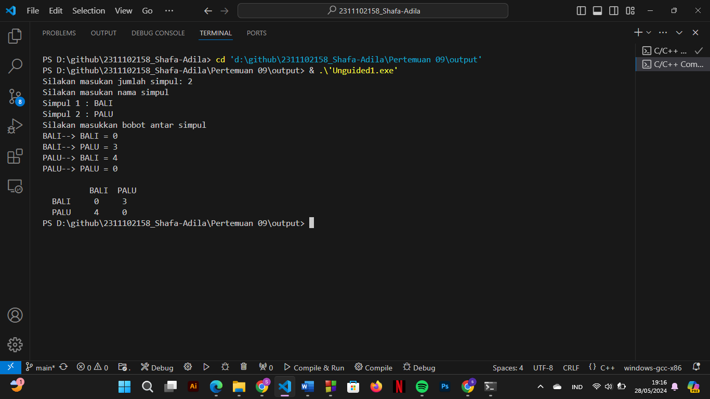

# <h1 align="center">Laporan Praktikum Modul Graph dan Tree</h1>
<p align="center">Shafa Adila Santoso - 2311102158</p>

## Dasar Teori

1.	Graph
Graph adalah jenis struktur data umum yang susunan datanya tidak berdekatan satu sama lain (non-linier). Graph terdiri dari kumpulan simpul berhingga untuk menyimpan data dan antara dua buah simpul terdapat hubungan saling keterkaitan. Struktur data ini juga digunakan untuk merepresentasikan hubungan antara objek dalam bentuk node atau vertex dan sambungan antara node tersebut dalam bentuk sisi atau edge. Graf terdiri dari simpul dan busur yang secara matematis dinyatakan sebagai :
G = (V, E), Dimana G adalah Graph, V adalah simpul atau vertex dan E sebagai sisi atau edge. Graph sendiri memiliki beberapa jenis diantaranya;
a.	Graph berarah
b.	Graph tak berarah
c.	Weight graph
2.	Tree 
Pohon Pohon (tree) adalah graf tak berarah terhubung yang tidak mengandung sirkuit. Tree memiliki bentuk nyata berupa pohon, ini terdiri dari satu set node tertaut yang terurut dalam grafik yang terhubung, dimana setiap node memiliki paling banyak satu simpul induk, dan nol atau lebih simpul anak dengan urutan tertentu. Struktur data tree digunakan untuk menyimpan data-data hirarki seperti pohon keluarga, skema pertandingan, struktur organisasi. Tree memiliki istilah diantaranya;
a.	Seccessor, merupakan node yang berada diatas node tertentu
b.	Ancestor, merupakan node yang berada dibawah node tertentu
c.	Descendent, merupakan seluruh node yang terletaksebelum node terentu dan terletak pda jalur yang sama.
d.	Parent, merupakan predecessor satu level diatas suatu node
e.	Shild, merupakan seccessor satu lvel dibawah satu node
f.	Sibling, merupakan node node yang memiliki parent yang sama
g.	Subtree, merupakan suatu nide beserta dengan descendent nya
h.	Size,   merupakan banyaknya node dalam suatu tree
i.	Height, merupakan banyaknya tingkatan atau level dalam suatu tree
j.	Roof, merupakan suatu nide khusus yang tidak memiliki predecessor
k.	Leaf, merupakan node node dalam tree yang tidak memiliki successor
l.	Degree, merupakan banyaknya child dalam suatu node
Operasi pada tree
a.	Create
b.	Clear
c.	isEmpty
d.	insert

## Guided 

### 1. [Program Graph ]

```C++
#include <iostream>
#include <iomanip>

using namespace std;

// Array nama kota (simpul)
string simpul[7] = {
    "Ciamis", "Bandung", "Bekasi", "Tasikmalaya", "Cianjur", "Purwokerto", "Yogyakarta"
};

// Matriks adjacency yang mewakili bobot busur antara simpul
int busur[7][7] = {
    {0, 7, 8, 0, 0, 0, 0},
    {0, 0, 5, 0, 0, 15, 0},
    {0, 6, 0, 0, 5, 0, 0},
    {0, 5, 0, 0, 2, 4, 0},
    {23, 0, 0, 10, 0, 0, 8},
    {0, 0, 0, 7, 0, 3, 0},
    {0, 0, 0, 9, 4, 0, 0}
};

// Fungsi untuk menampilkan graph
void tampilGraph(){
    for(int baris = 0; baris < 7; baris++){
        // Cetak nama simpul
        cout << " " << setiosflags(ios::left) << setw(15) << simpul[baris] << " : ";
        for (int kolom = 0; kolom < 7; kolom++){
            // Jika ada busur, cetak simpul yang terhubung dan bobotnya
            if (busur[baris][kolom] != 0){
                cout << " " << simpul[kolom] << " (" << busur[baris][kolom] << ")";
            }
        }
        cout << endl;
    }
}

int main(){
    // Panggil fungsi untuk menampilkan graph
    tampilGraph();
    return 0;
}
```
Program diatas merupakan program C++ yang mengimplementasikan penggunaan dari Graf. Graf ini terdiri dari simpul-simpul yang merepresentasikan kota-kota di Indonesia, seperti Ciamis, Bandung, Bekasi, Tasikmalaya, Cianjur, Purwokerto, dan Yogyakarta. Setiap simpul memiliki busur yang menghubungkannya dengan simpul lain, di mana busur tersebut memiliki bobot yang menunjukkan jarak antara simpul-simpul tersebut. Implementasi menggunakan matriks ketetanggaan untuk merepresentasikan hubungan antar simpul dan bobotnya. Program dimulai dengan deklarasi array untuk menyimpan nama-nama simpul (nodes) dan matriks untuk menyimpan bobot busur (edges) antara simpul-simpul. Selanjutnya, terdapat fungsi `tampilGraph()` yang bertugas untuk menampilkan representasi graf dalam bentuk teks yang mudah dibaca. Fungsi ini mengiterasi setiap simpul dan menampilkan simpul tujuan yang terhubung langsung dengan simpul tersebut beserta bobot busurnya. Dalam fungsi `main()`, program memanggil fungsi `tampilGraph()` untuk menampilkan graf ke layar. Hasil output program adalah representasi graf dengan setiap simpul diikuti oleh simpul-simpul tujuan yang terhubung langsung beserta bobot (jarak) antara simpul tersebut.

### 2. [Program Tree]

```C++
#include <iostream>
#include <iomanip>
using namespace std;

// Struktur data untuk Node Pohon
struct Pohon
{
    char data;
    Pohon *left, *right, *parent;
};

// Deklarasi variabel global root dan node baru
Pohon *root, *baru;

// Inisialisasi pohon (tree)
void init()
{
    root = NULL;
}

// Fungsi untuk mengecek apakah pohon kosong
bool isEmpty()
{
    return root == NULL;
}

// Fungsi untuk membuat node baru
void buatNode(char data)
{
    if (isEmpty())
    {
        // Jika pohon kosong, buat root
        root = new Pohon();
        root->data = data;
        root->left = NULL;
        root->right = NULL;
        root->parent = NULL;
        cout << "\n Node " << data << " berhasil dibuat sebagai root." << endl;
    }
    else
    {
        cout << "\n Tree sudah ada!" << endl;
    }
}

// Fungsi untuk menambahkan node di kiri
Pohon *insertLeft(char data, Pohon *node)
{
    if (isEmpty())
    {
        cout << "\n Buat tree terlebih dahulu!" << endl;
        return NULL;
    }
    else
    {
        if (node->left != NULL)
        {
            cout << "\n Node " << node->data << " sudah ada child kiri !" << endl;
            return NULL;
        }
        else
        {
            // Membuat node baru dan menghubungkannya sebagai child kiri
            Pohon *baru = new Pohon();
            baru->data = data;
            baru->left = NULL;
            baru->right = NULL;
            baru->parent = node;
            node->left = baru;
            cout << "\n Node " << data << " berhasil ditambahkan ke child kiri " << baru->parent->data << endl;
            return baru;
        }
    }
}

// Fungsi untuk menambahkan node di kanan
Pohon *insertRight(char data, Pohon *node)
{
    if (isEmpty())
    {
        cout << "\n Buat tree terlebih dahulu!" << endl;
        return NULL;
    }
    else
    {
        if (node->right != NULL)
        {
            cout << "\n Node " << node->data << " sudah ada child kanan !" << endl;
            return NULL;
        }
        else
        {
            // Membuat node baru dan menghubungkannya sebagai child kanan
            Pohon *baru = new Pohon();
            baru->data = data;
            baru->left = NULL;
            baru->right = NULL;
            baru->parent = node;
            node->right = baru;
            cout << "\n Node " << data << " berhasil ditambahkan ke child kanan " << baru->parent->data << endl;
            return baru;
        }
    }
}

// Fungsi untuk mengupdate data node
void update(char data, Pohon *node)
{
    if (isEmpty())
    {
        cout << "\n Buat tree terlebih dahulu!" << endl;
    }
    else
    {
        if (!node)
        {
            cout << "\n Node yang ingin diganti tidak ada!!" << endl;
        }
        else
        {
            char temp = node->data;
            node->data = data;
            cout << "\n Node " << temp << " berhasil diubah menjadi " << data << endl;
        }
    }
}

// Fungsi untuk mengambil data node
void retrieve(Pohon *node)
{
    if (isEmpty())
    {
        cout << "\n Buat tree terlebih dahulu!" << endl;
    }
    else
    {
        if (!node)
        {
            cout << "\n Node yang ditunjuk tidak ada!" << endl;
        }
        else
        {
            cout << "\n Data node : " << node->data << endl;
        }
    }
}

// Fungsi untuk mencari informasi node
void find(Pohon *node)
{
    if (isEmpty())
    {
        cout << "\n Buat tree terlebih dahulu!" << endl;
    }
    else
    {
        if (!node)
        {
            cout << "\n Node yang ditunjuk tidak ada!" << endl;
        }
        else
        {
            cout << "\n Data Node : " << node->data << endl;
            cout << " Root : " << root->data << endl;
            if (!node->parent)
                cout << " Parent : (tidak punya parent)" << endl;
            else
                cout << " Parent : " << node->parent->data << endl;
            if (node->parent != NULL && node->parent->left != node &&
                node->parent->right == node)
                cout << " Sibling : " << node->parent->left->data << endl;
            else if (node->parent != NULL && node->parent->right != node && node->parent->left == node)
                cout << " Sibling : " << node->parent->right->data << endl;
            else
                cout << " Sibling : (tidak punya sibling)" << endl;
            if (!node->left)
                cout << " Child Kiri : (tidak punya Child kiri)" << endl;
            else
                cout << " Child Kiri : " << node->left->data << endl;
            if (!node->right)
                cout << " Child Kanan : (tidak punya Child kanan)" << endl;
            else
                cout << " Child Kanan : " << node->right->data << endl;
        }
    }
}

// Penelusuran (Traversal) preOrder
void preOrder(Pohon *node = root)
{
    if (isEmpty())
    {
        cout << "\n Buat tree terlebih dahulu!" << endl;
    }
    else
    {
        if (node != NULL)
        {
            cout << " " << node->data << ", ";
            preOrder(node->left);
            preOrder(node->right);
        }
    }
}

// Penelusuran (Traversal) inOrder
void inOrder(Pohon *node = root)
{
    if (isEmpty())
    {
        cout << "\n Buat tree terlebih dahulu!" << endl;
    }
    else
    {
        if (node != NULL)
        {
            inOrder(node->left);
            cout << " " << node->data << ", ";
            inOrder(node->right);
        }
    }
}

// Penelusuran (Traversal) postOrder
void postOrder(Pohon *node = root)
{
    if (isEmpty())
    {
        cout << "\n Buat tree terlebih dahulu!" << endl;
    }
    else
    {
        if (node != NULL)
        {
            postOrder(node->left);
            postOrder(node->right);
            cout << " " << node->data << ", ";
        }
    }
}

// Fungsi untuk menghapus pohon
void deleteTree(Pohon *node)
{
    if (isEmpty())
    {
        cout << "\n Buat tree terlebih dahulu!" << endl;
    }
    else
    {
        if (node != NULL)
        {
            if (node != root)
            {
                node->parent->left = NULL;
                node->parent->right = NULL;
            }
            deleteTree(node->left);
            deleteTree(node->right);
            if (node == root)
            {
                delete root;
                root = NULL;
            }
            else
            {
                delete node;
            }
        }
    }
}

// Fungsi untuk menghapus subtree
void deleteSub(Pohon *node)
{
    if (isEmpty())
    {
        cout << "\n Buat tree terlebih dahulu!" << endl;
    }
    else
    {
        deleteTree(node->left);
        deleteTree(node->right);
        cout << "\n Node subtree " << node->data << " berhasil dihapus." << endl;
    }
}

// Fungsi untuk menghapus seluruh tree
void clear()
{
    if (isEmpty())
    {
        cout << "\n Buat tree terlebih dahulu!!" << endl;
    }
    else
    {
        deleteTree(root);
        cout << "\n Pohon berhasil dihapus." << endl;
    }
}

// Fungsi untuk mengecek ukuran tree
int size(Pohon *node = root)
{
    if (isEmpty())
    {
        cout << "\n Buat tree terlebih dahulu!!" << endl;
        return 0;
    }
    else
    {
        if (!node)
        {
            return 0;
        }
        else
        {
            return 1 + size(node->left) + size(node->right);
        }
    }
}

// Fungsi untuk mengecek tinggi (height) tree
int height(Pohon *node = root)
{
    if (isEmpty())
    {
        cout << "\n Buat tree terlebih dahulu!" << endl;
        return 0;
    }
    else
    {
        if (!node)
        {
            return 0;
        }
        else
        {
            int heightKiri = height(node->left);
            int heightKanan = height(node->right);
            if (heightKiri >= heightKanan)
            {
                return heightKiri + 1;
            }
            else
            {
                return heightKanan + 1;
            }
        }
    }
}

// Fungsi untuk menampilkan karakteristik tree
void characteristic()
{
    cout << "\n Size Tree : " << size() << endl;
    cout << " Height Tree : " << height() << endl;
    cout << " Average Node of Tree : " << size() / height() << endl;
}

// Fungsi utama (main)
int main()
{
    // Membuat node awal dan menambahkan beberapa node
    buatNode('A');
    Pohon *nodeB, *nodeC, *nodeD, *nodeE, *nodeF, *nodeG, *nodeH, *nodeI, *nodeJ;

    nodeB = insertLeft('B', root);
    nodeC = insertRight('C', root);
    nodeD = insertLeft('D', nodeB);
    nodeE = insertRight('E', nodeB);
    nodeF = insertLeft('F', nodeC);
    nodeG = insertLeft('G', nodeE);
    nodeH = insertRight('H', nodeE);
    nodeI = insertLeft('I', nodeG);
    nodeJ = insertRight('J', nodeG);

    // Mengupdate node
    update('Z', nodeC);
    update('C', nodeC);
    retrieve(nodeC);
    find(nodeC);

    // Menampilkan hasil penelusuran (traversal)
    cout << "\n PreOrder :" << endl;
    preOrder(root);
    cout << "\n" << endl;

    cout << " InOrder :" << endl;
    inOrder(root);
    cout << "\n" << endl;
    
    cout << " PostOrder :" << endl;
    postOrder(root);
    cout << "\n" << endl;

    return 0;
}
```
Programdiatas merupakan program c++ yang mengimplementasikan penggunaan dari Tree. Program ini memanfaatkan struktur data `Pohon` yang memiliki anggota untuk menyimpan nilai node, pointer ke anak kiri, anak kanan, dan induk node. Variabel global `root` dan `baru` digunakan untuk menyimpan root dari pohon dan node baru yang akan dibuat. Proses dimulai dengan inisialisasi pohon menggunakan fungsi `init`, yang mengatur `root` menjadi NULL. Kemudian, fungsi `isEmpty` digunakan untuk memeriksa apakah pohon kosong atau tidak. Fungsi `buatNode` digunakan untuk membuat node baru, dengan memeriksa apakah pohon masih kosong atau tidak. Node baru dapat ditambahkan sebagai anak kiri atau anak kanan menggunakan fungsi `insertLeft` dan `insertRight`. Program juga memiliki fungsi `update` untuk mengubah nilai data dari sebuah node, serta `retrieve` untuk menampilkan nilai data dari sebuah node. Fungsi `find` digunakan untuk mencari informasi terkait node yang ditentukan, seperti root, parent, sibling, anak kiri, dan anak kanan. Penelusuran pohon dilakukan menggunakan tiga jenis traversal: pre-order, in-order, dan post-order, yang diimplementasikan melalui fungsi `preOrder`, `inOrder`, dan `postOrder`.  Program juga menyediakan fungsi untuk menghapus seluruh pohon atau subtree (`deleteTree` dan `deleteSub`), serta untuk menghapus seluruh pohon (`clear`). Fungsi `size` digunakan untuk menghitung jumlah node dalam pohon, sementara `height` menghitung tinggi pohon. Di dalam fungsi `main`, beberapa node dibuat dan ditambahkan ke pohon, kemudian dilakukan beberapa operasi seperti mengupdate node, mengambil data node, mencari informasi node, dan menampilkan hasil penelusuran pohon.


## Unguided 

### 1. [Buatlah program graph dengan menggunakan inputan user untuk menghitung jarak dari sebuah kota ke kota lainnya.]

```C++
#include <iostream>
#include <vector>
#include <iomanip> // untuk std::setw

using namespace std;

int main() {
    // Meminta pengguna untuk memasukkan jumlah simpul
    int jmlSimpul_2311102158;
    cout << "Silakan masukan jumlah simpul: ";
    cin >> jmlSimpul_2311102158;

    // Mendeklarasikan vektor untuk menyimpan nama simpul
    vector<string> namaSimpul_2311102158(jmlSimpul_2311102158);
    cout << "Silakan masukan nama simpul" << endl;
    // Meminta pengguna untuk memasukkan nama-nama simpul
    for(int i = 0; i < jmlSimpul_2311102158; ++i) {
        cout << "Simpul " << i+1 << " : ";
        cin >> namaSimpul_2311102158[i];
    }

    // Matriks untuk menyimpan bobot antar simpul
    vector<vector<int>> matriksBobot(jmlSimpul_2311102158, vector<int>(jmlSimpul_2311102158));

    // Meminta pengguna untuk memasukkan bobot antar simpul
    cout << "Silakan masukkan bobot antar simpul" << endl;
    for(int i = 0; i < jmlSimpul_2311102158; ++i) {
        for(int j = 0; j < jmlSimpul_2311102158; ++j) {
            cout << namaSimpul_2311102158[i] << "--> " << namaSimpul_2311102158[j] << " = ";
            cin >> matriksBobot[i][j];
        }
    }

    // Menampilkan matriks bobot
    cout << "\n\t";
    for(int i = 0; i < jmlSimpul_2311102158; ++i) {
        cout << setw(6) << namaSimpul_2311102158[i];
    }
    cout << endl;

    for(int i = 0; i < jmlSimpul_2311102158; ++i) {
        cout << setw(6) << namaSimpul_2311102158[i];
        for(int j = 0; j < jmlSimpul_2311102158; ++j) {
            cout << setw(6) << matriksBobot[i][j];
        }
        cout << endl;
    }

    return 0;
}
```
#### Output:


Program di atas adalah sebuah program C++ sederhana yang meminta pengguna untuk memberikan informasi tentang jumlah simpul, nama-nama simpul, dan bobot antar simpul dalam sebuah graf. Pertama, program meminta pengguna untuk memasukkan jumlah simpul yang akan dimasukkan. Selanjutnya, program meminta pengguna untuk memasukkan nama-nama simpul tersebut satu per satu. Setelah itu, program meminta pengguna untuk memasukkan bobot antar simpul dan menyimpan informasi bobot tersebut dalam sebuah matriks. Terakhir, program menampilkan matriks bobot tersebut dalam bentuk tabel, dengan nama simpul sebagai header baris dan kolom, serta bobot antar simpul sebagai isi dari matriks.


### 2. [Modifikasi guided tree diatas dengan program menu menggunakan input data tree dari user dan berikan fungsi tambahan untuk menampilkan node child dan descendant dari node yang diinput kan! ]

```C++
#include <iostream>
#include <vector>
#include <string>

using namespace std;

// Struktur data untuk merepresentasikan node pada pohon
struct Pohon {
    char data_2311102158;  // Data yang disimpan pada node
    Pohon *left, *right, *parent;  // Pointer ke child kiri, child kanan, dan parent node
};

// Deklarasi global untuk root pohon
Pohon *root = NULL;

// Fungsi untuk inisialisasi pohon
void init() {
    root = NULL;
}

// Fungsi untuk memeriksa apakah pohon kosong
bool isEmpty() {
    return root == NULL;
}

// Fungsi untuk membuat node baru sebagai root
void buatNode(char data) {
    if (isEmpty()) {
        // Jika pohon kosong, buat root baru
        root = new Pohon();
        root->data_2311102158 = data;
        root->left = NULL;
        root->right = NULL;
        root->parent = NULL;
        cout << "\nNode " << data << " berhasil dibuat sebagai root." << endl;
    } else {
        cout << "\nTree sudah ada!" << endl;
    }
}

// Fungsi untuk menambahkan node di sebelah kiri suatu node
Pohon* insertLeft(char data, Pohon* node) {
    if (isEmpty()) {
        cout << "\nBuat tree terlebih dahulu!" << endl;
        return NULL;
    } else {
        if (node->left != NULL) {
            cout << "\nNode " << node->data_2311102158 << " sudah memiliki child kiri!" << endl;
            return NULL;
        } else {
            // Buat node baru dan hubungkan sebagai child kiri
            Pohon* baru = new Pohon();
            baru->data_2311102158 = data;
            baru->left = NULL;
            baru->right = NULL;
            baru->parent = node;
            node->left = baru;
            cout << "\nNode " << data << " berhasil ditambahkan ke child kiri " << baru->parent->data_2311102158 << endl;
            return baru;
        }
    }
}

// Fungsi untuk menambahkan node di sebelah kanan suatu node
Pohon* insertRight(char data, Pohon* node) {
    if (isEmpty()) {
        cout << "\nBuat tree terlebih dahulu!" << endl;
        return NULL;
    } else {
        if (node->right != NULL) {
            cout << "\nNode " << node->data_2311102158 << " sudah memiliki child kanan!" << endl;
            return NULL;
        } else {
            // Buat node baru dan hubungkan sebagai child kanan
            Pohon* baru = new Pohon();
            baru->data_2311102158 = data;
            baru->left = NULL;
            baru->right = NULL;
            baru->parent = node;
            node->right = baru;
            cout << "\nNode " << data << " berhasil ditambahkan ke child kanan " << baru->parent->data_2311102158 << endl;
            return baru;
        }
    }
}

// Fungsi untuk mengupdate data suatu node
void update(char data, Pohon* node) {
    if (isEmpty()) {
        cout << "\nBuat tree terlebih dahulu!" << endl;
    } else {
        if (!node) {
            cout << "\nNode yang ingin diganti tidak ada!" << endl;
        } else {
            char temp = node->data_2311102158;
            node->data_2311102158 = data;
            cout << "\nNode " << temp << " berhasil diubah menjadi " << data << endl;
        }
    }
}

// Fungsi untuk mengambil data suatu node
void retrieve(Pohon* node) {
    if (isEmpty()) {
        cout << "\nBuat tree terlebih dahulu!" << endl;
    } else {
        if (!node) {
            cout << "\nNode yang ditunjuk tidak ada!" << endl;
        } else {
            cout << "\nData node: " << node->data_2311102158 << endl;
        }
    }
}

// Fungsi untuk mencari informasi suatu node
void find(Pohon* node) {
    if (isEmpty()) {
        cout << "\nBuat tree terlebih dahulu!" << endl;
    } else {
        if (!node) {
            cout << "\nNode yang ditunjuk tidak ada!" << endl;
        } else {
            cout << "\nData Node: " << node->data_2311102158 << endl;
            cout << "Root: " << root->data_2311102158 << endl;
            if (!node->parent) cout << "Parent: (tidak punya parent)" << endl;
            else cout << "Parent: " << node->parent->data_2311102158 << endl;
            if (node->parent != NULL && node->parent->left != node && node->parent->right == node) cout << "Sibling: " << node->parent->left->data_2311102158 << endl;
            else if (node->parent != NULL && node->parent->right != node && node->parent->left == node) cout << "Sibling: " << node->parent->right->data_2311102158 << endl;
            else cout << "Sibling: (tidak punya sibling)" << endl;
            if (!node->left) cout << "Child Kiri: (tidak punya Child kiri)" << endl;
            else cout << "Child Kiri: " << node->left->data_2311102158 << endl;
            if (!node->right) cout << "Child Kanan: (tidak punya Child kanan)" << endl;
            else cout << "Child Kanan: " << node->right->data_2311102158 << endl;
        }
    }
}

// Penelusuran preOrder
void preOrder(Pohon* node) {
    if (node != NULL) {
        cout << " " << node->data_2311102158;
        preOrder(node->left);
        preOrder(node->right);
    }
}

// Penelusuran inOrder
void inOrder(Pohon* node) {
    if (node != NULL) {
        inOrder(node->left);
        cout << " " << node->data_2311102158;
        inOrder(node->right);
    }
}

// Penelusuran postOrder
void postOrder(Pohon* node) {
    if (node != NULL) {
        postOrder(node->left);
        postOrder(node->right);
        cout << " " << node->data_2311102158;
    }
}

// Fungsi untuk menampilkan child dari suatu node
void tampilkanChild(Pohon* node) {
    if (node) {
        if (node->left) cout << "Child Kiri: " << node->left->data_2311102158 << endl;
        else cout << "Child Kiri: (tidak punya Child kiri)" << endl;
        if (node->right) cout << "Child Kanan: " << node->right->data_2311102158 << endl;
        else cout << "Child Kanan: (tidak punya Child kanan)" << endl;
    } else {
        cout << "\nNode yang ditunjuk tidak ada!" << endl;
    }
}

// Fungsi untuk menampilkan descendant dari suatu node
void tampilkanDescendants(Pohon* node) {
    if (node) {
        preOrder(node);
    } else {
        cout << "\nNode yang ditunjuk tidak ada!" << endl;
    }
}

// Fungsi untuk mencari node berdasarkan data
Pohon* searchNode(Pohon* node, char data) {
    if (node == NULL || node->data_2311102158 == data) {
        return node;
    }
    Pohon* leftSearch = searchNode(node->left, data);
    if (leftSearch) return leftSearch;
    return searchNode(node->right, data);
}

// Fungsi untuk menghitung ukuran pohon
int size(Pohon *node = root) {
    if (isEmpty()) {
        cout << "\nBuat tree terlebih dahulu!!" << endl;
        return 0;
    } else {
        if (!node) {
            return 0;
        } else {
            return 1 + size(node->left) + size(node->right);
        }
    }
}

// Fungsi untuk menghitung total nilai node pada pohon
int totalNodeValue(Pohon* node) {
    if (node == NULL) {
        return 0;
    }
    return (node->data_2311102158 - '0') + totalNodeValue(node->left) + totalNodeValue(node->right);
}

// Fungsi untuk menghitung tinggi pohon
int height(Pohon *node = root) {
    if (isEmpty()) {
        cout << "\nBuat tree terlebih dahulu!" << endl;
        return 0;
    } else {
        if (!node) {
            return 0;
        } else {
            int heightKiri = height(node->left);
            int heightKanan = height(node->right);
            if (heightKiri >= heightKanan) {
                return heightKiri + 1;
            } else {
                return heightKanan + 1;
            }
        }
    }
}

// Fungsi untuk menampilkan karakteristik pohon
void characteristic() {
    cout << "\n Size Tree : " << size() << endl;
    cout << " Height Tree : " << height() << endl;
    cout << " Average Node of Tree : " << size() / height() << endl;
}

// Fungsi utama
int main() {
    int pilihan_2311102158;
    char data_2311102158;
    char ParentData_2311102158;
    Pohon* node;

    do {
        cout << "\n========Menu Program Tree========" << endl;
        cout << "1. Buat Node Root" << endl;
        cout << "2. Tambah Child Kiri" << endl;
        cout << "3. Tambah Child Kanan" << endl;
        cout << "4. Update Node" << endl;
        cout << "5. Retrieve Node" << endl;
        cout << "6. Find Node" << endl;
        cout << "7. PreOrder Traversal" << endl;
        cout << "8. InOrder Traversal" << endl;
        cout << "9. PostOrder Traversal" << endl;
        cout << "10. Tampilkan Child" << endl;
        cout << "11. Tampilkan Descendant" << endl;
        cout << "12. Characteristic Tree" << endl;
        cout << "0. Keluar" << endl;
        cout << "Pilihan Menu: ";
        cin >> pilihan_2311102158;

        switch (pilihan_2311102158) {
            case 1:
                cout << "Masukkan data root: ";
                cin >> data_2311102158;
                buatNode(data_2311102158);
                break;
            case 2:
                cout << "Masukkan data parent: ";
                cin >> ParentData_2311102158;
                node = searchNode(root, ParentData_2311102158);
                if (node) {
                    cout << "Masukkan data untuk child kiri: ";
                    cin >> data_2311102158;
                    insertLeft(data_2311102158, node);
                } else {
                    cout << "Node parent tidak ditemukan!" << endl;
                }
                break;
            case 3:
                cout << "Masukkan data parent: ";
                cin >> ParentData_2311102158;
                node = searchNode(root, ParentData_2311102158);
                if (node) {
                    cout << "Masukkan data untuk child kanan: ";
                    cin >> data_2311102158;
                    insertRight(data_2311102158, node);
                } else {
                    cout << "Node parent tidak ditemukan!" << endl;
                }
                break;
            case 4:
                cout << "Masukkan data node yang akan di-update: ";
                cin >> ParentData_2311102158;
                node = searchNode(root, ParentData_2311102158);
                if (node) {
                    cout << "Masukkan data baru: ";
                    cin >> data_2311102158;
                    update(data_2311102158, node);
                } else {
                    cout << "Node tidak ditemukan!" << endl;
                }
                break;
            case 5:
                cout << "Masukkan data node yang akan diretrieve: ";
                cin >> ParentData_2311102158;
                node = searchNode(root, ParentData_2311102158);
                retrieve(node);
                break;
            case 6:
                cout << "Masukkan data node yang akan dicari: ";
                cin >> ParentData_2311102158;
                node = searchNode(root, ParentData_2311102158);
                find(node);
                break;
            case 7:
                cout << "\nPreOrder Traversal:" << endl;
                preOrder(root);
                cout << "\n" << endl;
                break;
            case 8:
                cout << "\nInOrder Traversal:" << endl;
                inOrder(root);
                cout << "\n" << endl;
                break;
            case 9:
                cout << "\nPostOrder Traversal:" << endl;
                postOrder(root);
                cout << "\n" << endl;
                break;
            case 10:
                cout << "Masukkan data node yang akan ditampilkan child-nya: ";
                cin >> ParentData_2311102158;
                node = searchNode(root, ParentData_2311102158);
                if (node) {
                    tampilkanChild(node);
                } else {
                    cout << "Node tidak ditemukan!" << endl;
                }
                break;
            case 11:
                cout << "Masukkan data node yang akan ditampilkan descendant-nya: ";
                cin >> ParentData_2311102158;
                node = searchNode(root, ParentData_2311102158);
                if (node) {
                    cout << "Descendants dari node " << ParentData_2311102158 << ": ";
                    tampilkanDescendants(node);
                    cout << endl;
                } else {
                    cout << "Node tidak ditemukan!" << endl;
                }
                break;
            case 12:
                characteristic();
                break;
            case 0:
                cout << "Keluar." << endl;
                break;
            default:
                cout << "Opsi tidak valid!" << endl;
                break;
        }
    } while (pilihan_2311102158 != 0);

    return 0;
}
```
#### Output:
.png)
.png)
.png)
.png)
.png)
.png)
.png)
.png)
.png)
.png)
.png)
.png)
.png)
.png)
.png)
.png)
.png)
.png)
.png)
.png)

Program diatas merupakan program c++ yang mengimplementasikan dari penggunaan Tree. Program tersebut memanfaatkan struktur data dan berbagai fungsi untuk melakukan berbagai operasi pada pohon biner, seperti membuat node baru, menambahkan child (baik kiri maupun kanan), mengupdate data node, melakukan pencarian node, serta melakukan penelusuran (traversal) preOrder, inOrder, dan postOrder. Pertama-tama, program mendefinisikan sebuah struktur data `Pohon` yang merepresentasikan node pada pohon. Setiap node memiliki data yang disimpan (`data_2311102158`), serta pointer yang menunjukkan ke child kiri (`left`), child kanan (`right`), dan parent (`parent`). Selain itu, program juga mendeklarasikan variabel global `root` yang digunakan untuk menyimpan pointer ke root dari pohon, serta sebuah fungsi `init()` untuk menginisialisasi pohon dengan mengatur `root` menjadi `NULL`. Selanjutnya, program menyediakan fungsi-fungsi dasar untuk manipulasi pohon, seperti `isEmpty()` untuk memeriksa apakah pohon kosong, `buatNode()` untuk membuat node baru sebagai root jika pohon masih kosong, `insertLeft()` dan `insertRight()` untuk menambahkan node di sebelah kiri atau kanan suatu node, dan lain sebagainya. Terdapat pula fungsi-fungsi untuk penelusuran (traversal) pohon, seperti `preOrder()`, `inOrder()`, dan `postOrder()`, yang masing-masing melakukan penelusuran preOrder, inOrder, dan postOrder pada pohon, dimulai dari root dan menelusuri ke child kiri dan kanan. Selain itu, program juga menyediakan fungsi-fungsi tambahan seperti `tampilkanChild()` untuk menampilkan child dari suatu node, `tampilkanDescendants()` untuk menampilkan descendant dari suatu node, serta `searchNode()` untuk mencari node berdasarkan data. Fungsi `size()`, `totalNodeValue()`, dan `height()` digunakan untuk menghitung ukuran (jumlah node), total nilai node, dan tinggi pohon secara berturut-turut. Terakhir, terdapat fungsi `characteristic()` yang menampilkan karakteristik pohon seperti ukuran, tinggi, dan rata-rata node. Fungsi utama `main()` memulai program dengan menampilkan menu pilihan operasi yang dapat dilakukan pada pohon. Setiap pilihan akan memanggil fungsi yang sesuai sesuai dengan kebutuhan pengguna, dan program akan berjalan dalam loop hingga pengguna memilih untuk keluar.

## Kesimpulan
Dengan dilaksanakannya praktikum ini dapat membantu mahasiswa dalam memahami graph dan tree, selain itu mahasiswa juga menjadi mampu dalam mengimplementasikan graph dan tree[1].

## Referensi
[1] Kusumastuti, N., & Fran, F. (2022). Bilangan Invers Dominasi Total Graf Helm Tertutup, Graf Gear, Graf Roda Ganda Dan Graf Antiweb-Gear. Teorema: Teori dan Riset Matematika, 7(2), 321-330.</br>
[2] Nugraha, W., Syarif, M., & Sabaruddin, R. (2021). ANALISA MODEL POHON DAN GRAF PADA GAME PERFECT WORLD 2 ONLINE. JTIK (Jurnal Teknik Informatika Kaputama), 5(1), 1-8.</br>