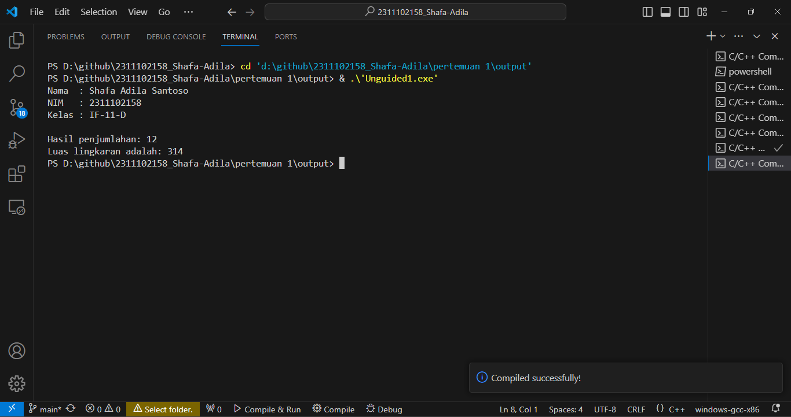
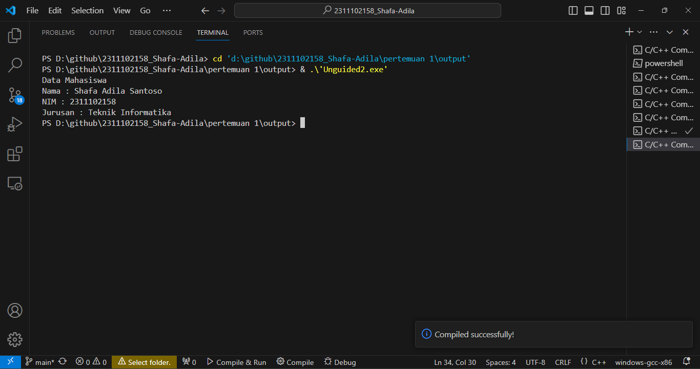
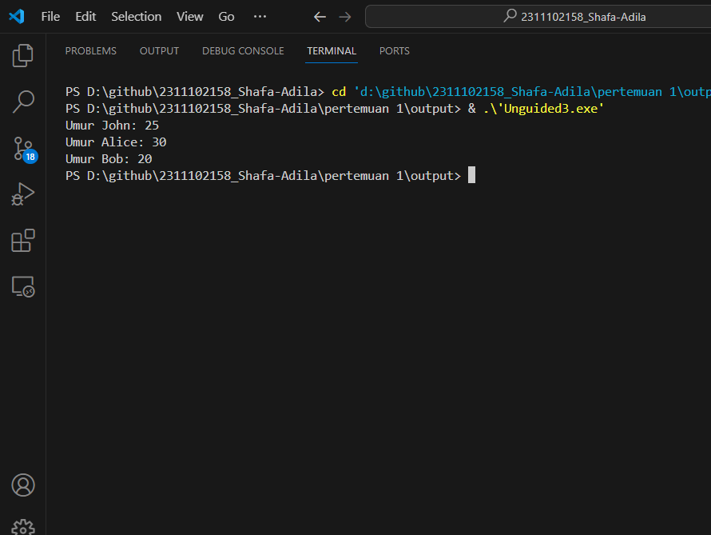

# <h1 align="center">Laporan Praktikum Modul Tipe Data</h1>
<p align="center">Shafa Adila Santoso - 2311102158</p>

## Dasar Teori

Tipe data adalah jenis data yang dapat diolah oleh komputer untuk memenuhi kebutuhan dalam pemrogramam komputer. Tipe data ini berguna agar bahasa pmerograman dapat mengetahui apa yang diintruksikan terhadap data yang akan diolah. Ada 3 macam tipe data, diantaranya;
1.	tipe Data Primitive
Tipe data primitive adalah sebuah tipe data yang hanya mampuuntuk menyimpan satu nilai pada setiap satu variabel. Contoh tipe data primitiv yaitu;
-	Integer : tipe data yang digunakan untuk menyimpan bilangan bulat.
-	Float : tipe data ini digunakan untuk menyimpan bilangan dalam bentuk desimal.
-	Char : tipe data ini digunakan untuk menyimpan karakter seperti huruf.
-	Boolean : tipe data ini adlah tipe data logika yang hanya memiliki dua nilai yaitu true dan false.
2.	Tipe data abstrak (TDA) merupakan sebuah model matematika dari objek data yang menyempurnakan tipe data dengan cara mengkaitkannya dengan fungsi-fungsi yang beroperasi pada data yang bersnagkutan. Tipe Data Abstrak adalah tipe data tertentu yang didefinisikan oleh pemrogram untuk kemudahan pemrograman serta untuk mengakomodasi tipe tipe data yang tidak secara spesifik diakomodasi oleh bahasa pemrograman yang digunakan.
3.	Tipe Data Koleksi adalah sebuah tipe data yang berguna untuk menyimpan dan mengakses kumpulan data yang lebih dari satu. Tipe data koleksi dapat digunakan dapat digunakan untuk menyimpan beberapa elemen data yang dapat diubah-ubah. Terdapat 3 jenis data koleksi diantarnya array, Vector dam Map.


## Guided 

### 1. Tipe Data Primitif

```C++
#include <iostream>
#include <iomanip>

using namespace std;

int main() {
    char op;
    float num1, num2;

    
    cout << "Enter operator (+, -, *, /): ";
    cin >> op;
   
    cout << "Enter two operands: ";
    cin>>num1>>num2;

    switch (op) {
// If user enters +
    case '+':
        cout << "Result: " << num1 + num2;
        break;
// If user enters -
    case '-':
        cout << "Result: " << num1 - num2;
        break;
// If user enters *
    case '*':
        cout << "Result: " << num1 * num2;
        break;
// If user enters /
    case '/':
    if (num2 != 0) {
        cout << "Result: " << fixed << setprecision(2) <<num1 / num2;
    } else {
        cout << "Error! Division by zero is not allowed.";
    }
    break;

default:
    cout << "Error! Operator is not correct";
} 
return 0;
}

```
Program diatas adalah sebuah program penghitungan operasi aritmatika. pengguna diminta untuk memasukkan pilihan (+,-,*,/) dan juga memasukkan 2 bilangan yang akan dihitung.setelah memasukkan pilihan dan juga bilangan maka output akan menampilkan hasil dari operasi bilangan yang dipilih.

### 2. Tipe Data Abstrak

```C++
#include <stdio.h>
#include <string.h>

//Struct
struct Mahasiswa
{
    char name[50];
    char address[100];
    int age;
};
int main()
{

// menggunakan struct
struct Mahasiswa mhs1, mhs2;
// mengisi nilai ke struct
strcpy(mhs1.name, "Dian");
strcpy(mhs1.address, "Mataram");
mhs1.age = 22;
strcpy(mhs2.name, "Bambang");
strcpy(mhs2.address, "Surabaya");
mhs2.age = 23;

// mencetak isi struct
printf("## Mahasiswa 1 ##\n");
printf("Nama: %s\n", mhs1.name);
printf("Alamat: %s\n", mhs1.address);
printf("Umur: %d\n", mhs1.age);
printf ("\n");
printf("## Mahasiswa 2 ##\n");
printf("Nama: %s\n", mhs2.name);
printf("Alamat: %s\n", mhs2.address);
printf("Umur: %d\n", mhs2.age);
return 0;
}

```
Program diatas adalah sebuah program dengan menggunakan struct ynag berisi informasi data mahasiswa. didalam struct terdapat variabel untuk menyimpan nama, alamat, dan umur. serta dalam program terdapar dua variabel struct yang didefinisikan sebagai mhs1 dan mhs2. dan pada akhirnya program akan menampilkan informasi yang disimpan dalam struct mhs1 dan mhs2.

### 3. Tipe Data Koleksi

```C++
#include <iostream>
#include <array>
using namespace std;

int main() {
// Deklarasi dan inisialisasi array
    int nilai[5];
    nilai[0] = 23;
    nilai[1] = 50;
    nilai[2] = 34;
    nilai[3] = 78;
    nilai[4] = 90;
    
    // Mencetak array dengan tab
    cout << "Isi array pertama : " << nilai[0] << endl;
    cout << "Isi array kedua : " << nilai[1] << endl;
    cout << "Isi array ketiga : " << nilai[2] << endl;
    cout << "Isi array keempat : " << nilai[3] << endl;
    cout << "Isi array kelima : " << nilai[4] << endl;

    return 0;
}

```
Program diatas adlaah program yang menggunakan array. array adalah sebuah wadah dimana kita dapat menyimpan beberapa variabel atau data dalam satu tempat. dalam program diatas kita dapat menyimpan beberapa nilai dalam array yang bernama "nilai" dn menyimpan 5 bilangan yaitu 23, 50, 34, 78, dan 90. kemudian akan ditampilkan pada output.

## Unguided 

### 1. Buatlah program menggunakan tipe data primitif minimal dua fungsi dan bebas. Menampilkan program, jelaskan program tersebut dan ambil kesimpulan dari materi tipe data primitif! 

```C++
#include <iostream>
using namespace std;

// Fungsi integer untuk menjumlahkan dua bilangan bulat
int penjumlahan_shafa158(int angka1_shafa158, int angka2_shafa158) {
    return angka1_shafa158 + angka2_shafa158;
}

// Fungsi float untuk menghitung luas lingkaran dengan pi yang merupakan bilangan desimal
float LuasLingkaran_shafa158(float Jarijari_shafa158) {
    const float pi = 3.14; // Nilai pi
    return pi * Jarijari_shafa158 * Jarijari_shafa158; // Rumus luas lingkaran
}

int main() {
    // Deklarasi dan inisialisasi variabel
    int angka1 = 8, angka2 = 4;
    float jarijari = 10;

    //output nama, nim, dan kelas 
    cout << "Nama  : Shafa Adila Santoso" << endl;
    cout << "NIM   : 2311102158" << endl;
    cout << "Kelas : IF-11-D" << endl;
    cout << endl;

    // Memanggil fungsi tambah dan menampilkan output hasil penjumlahan
    cout << "Hasil penjumlahan: " << penjumlahan_shafa158(angka1, angka2) << endl;

    // Memanggil fungsi LuasLingkaran dan menampilkan output hasil luas lingkaran
    cout << "Luas lingkaran adalah: " << LuasLingkaran_shafa158(jarijari) << endl;
    return 0;
}

```
#### Output:


1.	Program diatas adalah sebuah program c++ yang mendefinisikan dua buah fungsi dan menggunakan tipe data primitif untukmenghitung luas lingkaran.
a.	Fungsi integer `penjumlahan_158(int angka1_158, int angka2_158)` ini memiliki dua buah parameter berbentuk bilangan bulat, lalu menjumlahkannya dan kemudian mengembalikan hasilnya.
b.	Fungsi float `float LuasLingkaran_158(float Jarijari_158)` memiliki satu parameter yang berbentuk bilangan pecahan. Dalam fungsi ini memiliki nilai pi yang sudah ditetapkan yaitu 3.24, dan kemudian mengembalikan luas lingkaran berdasarkan rumus pi*jarijari*jarijari.
c.	Fungsi `main()` ini merupakan fungsi utama dari program ini. Didalamnya mendeklarasikan dan menginisialisasikan variabel   angka1 = 8, angka2 = 4, dan jarijari = 10. Kemudian dilakukan pemanggilan fungsi penjumlahan_158 dengan `angka1` dan `angka2` dan menampilkan output hasilnya. Selanjutnya dilakukan pemanggilan fungsi `LuasLingkaran_shafa158` dengan `jarijari` dan menmapilkan output hasilnya.
d.	Return 0 pada program menandakan bahwa program telah berakhir dan mengembalikan nilain 0 sebagai tanda bahwa program sudah berjalan dengan baik.
e.	Output dari program tersebut berupa hasil penjumlahan dua angka dan luas lingkaran dengan jari-jari yang telah ditentukan.

Kesimpulan dari Materi Tipe Data Primitif:
Tipe data primitif seperti integer dan float sangat berguna dalam pemrograman karena mereka menyimpan nilai dasar seperti angka. Dalam pemrograman C++, tipe data primitif memungkinkan kita untuk melakukan operasi matematika dan manipulasi data dengan mudah. Dengan menggunakan tipe data primitif yang sesuai dengan kebutuhan program dapat membantu mengoptimalkan penggunaan memori dan meningkatkan kinerja program. Penting untuk memahami batasan dan perilaku tipe data primitif, seperti rentang nilai yang dapat disimpan dan presisi floating point.


### 2. Jelaskan fungsi dari class dan struct secara detail dan berikan contoh programnya

```C++
#include <iostream>
#include <string>
using namespace std;

// Mendefinisikan struct untuk data mahasiswa
struct MahasiswaData {
    string nama_shafa158;
    string jurusan_shafa158;
    string NIM_shafa158;
};

// Mendefinisikan class Mahasiswa
class Mahasiswa {
private:
    MahasiswaData data; // Objek MahasiswaData sebagai atribut private

public:
    // Constructor untuk class Mahasiswa
    Mahasiswa(string nama, string jurusan, string NIM) {
        data.nama_shafa158 = nama;
        data.jurusan_shafa158 = jurusan;
        data.NIM_shafa158 = NIM;
    }

    // Prosedur untuk menampilkan data mahasiswa
    void tampilkanData() {
        cout << "Data Mahasiswa" << endl;
        cout << "Nama : " << data.nama_shafa158 << endl;
        cout << "NIM : " << data.NIM_shafa158 << endl;
        cout << "Jurusan : " << data.jurusan_shafa158 << endl;
    }

    // Metode untuk mengambil data mahasiswa
    MahasiswaData getData() {
        return data;
    }

    // Metode untuk mengatur data mahasiswa
    void setData(string nama, string jurusan, string NIM) {
        data.nama_shafa158 = nama;
        data.jurusan_shafa158 = jurusan;
        data.NIM_shafa158 = NIM;
    }
};

int main() {
    // Membuat objek mhs dari class Mahasiswa dengan data yang telah ditentukan
    Mahasiswa mhs("Shafa Adila Santoso", "Teknik Informatika", "2311102158");

    // Memanggil prosedur tampilkanData untuk menampilkan data mahasiswa pada output
    mhs.tampilkanData();

    return 0;
}

```
#### Output:


Program di atas adalah sebuah program C++ yang mendefinisikan sebuah struct MahasiswaData untuk menyimpan data mahasiswa, termasuk nama, jurusan, dan NIM. Selanjutnya, sebuah class Mahasiswa dibuat untuk merepresentasikan objek mahasiswa yang memiliki atribut data bertipe MahasiswaData. Program ini menggunakan konstruktor untuk inisialisasi data mahasiswa saat objek Mahasiswa dibuat. Metode tampilkanData() digunakan untuk menampilkan data mahasiswa ke layar. Program ini memanfaatkan struktur data untuk menyimpan informasi yang terkait dengan mahasiswa dan menggunakan class untuk mengelola data dan perilaku terkait mahasiswa tersebut.

Struct adalah kumpulandari beberapa variabel dengan beragam tipe data yang dibungkus dalam satu variabel. Struct berfungsi untuk mengelompokkan berbagai jenis tipe data yang berbeda menjadi satu unit. Hal ini dapat memungkinkan programmer dapat membuat jenis data baru yang meliputi sejumlah variabel dengan tipe data yang berbeda.

Class merupakan suatu blueprint atau cetakan untuk mendefinisikan variable dan methode pada seluruh objek tertentu. Class ini memiliki fungsi untuk menampung isi dari program yang akan dijalankan, yang iddalamnya berisi tipe data dan method untuk menjalankan suatu program. Selain itu class berfungsi untuk mengorgnaisir kode menjadi unit yang lebib terstruktur dan class juga memungkinkan untuk pembuatan program yang lebih besar dan kompleks dengan memanfaatkan konsep seperti pewarisan.


### 3. Buat dan jelaskan program menggunakan fungsi map dan jelaskan perbedaan dari array dengan map.

```C++
#include <iostream> //Library untuk input-output stream
#include <map> //Library untuk map
using namespace std; //namespace std digunakan agar tidka perlu menuliskan std::

int main() {
    // Membuat map dengan pasangan kunci-nilai bertipe string dan int
    map<string, int> dataMap_shafa158;

    // Memasukkan elemen ke dalam map
    dataMap_shafa158["John"] = 25;
    dataMap_shafa158["Alice"] = 30;
    dataMap_shafa158["Bob"] = 20;

    // Mengakses dan mencetak nilai yang terkait dengan kunci tertentu
    cout << "Umur John: " << dataMap_shafa158["John"] << endl;
    cout << "Umur Alice: " << dataMap_shafa158["Alice"] << endl;
    cout << "Umur Bob: " << dataMap_shafa158["Bob"] << endl;

    return 0;
}

```
#### Output:


Program tersebut merupakan contoh penggunaan map dalam C++, di mana sebuah map dengan pasangan kunci-nilai bertipe string dan int dibuat. Tiga elemen dimasukkan ke dalam map dengan menggunakan kunci bertipe string sebagai nama dan nilai bertipe int sebagai umur. Setelah itu, nilai-nilai yang terkait dengan kunci tertentu diakses dan dicetak ke layar, seperti umur John, Alice, dan Bob. 

Perbeedaan yang dapat dilihat dari array dan map yaitu :
1.	Array tidak mengizinkan perpindahan elemen, sedangkan map mengizinkan duplikasi key
2.	Array dapat mengizinkan duplikasi elemen, sedangkan map tidak bisa mengizinkan duplikasi elemen
3.	Array dapat diteruskan secara otomatis,sedangkan map tidka bisa secara otomatis
4.	Array lebih efisien dalam penggunaan saat megakses elemen dengan menggunakan indeks, sedangkan map lebih efisien dalam penggunaan ketika mengakses elemen dengan menggunakan key.
5.	Array ini digunakan untuk menyimpan sekumpulan elemen yang dapat diakses menggunakan indeks, sedangkan map digunakan untuk menyimpan kumpulan key-value pair yang dapat diakses menggunakan key.


## Kesimpulan
Dalam penggunaan tipe data c++, penting sekali untuk mengetahui jenis jenis dari tipe data. Pemilihan tipe data yang tepat juga penting untuk membantu seorang progammer dalam mengetahui efisiensi dan keamanan program, serta untuk menghindari kelebihan atau kekurangan dari penggunaan memori.

## Referensi
[1] Syahidin, M.M. Mengenal Jenis-jenis Tipe Data dalam Bahasa C++. Jurnal MMS, 2019. <br/>
[2] Hanief, S., Jepriana, I. W., & Kom, S. (2020). Konsep Algoritme dan Aplikasinya dalam Bahasa Pemrograman C++. Penerbit Andi.<br/>